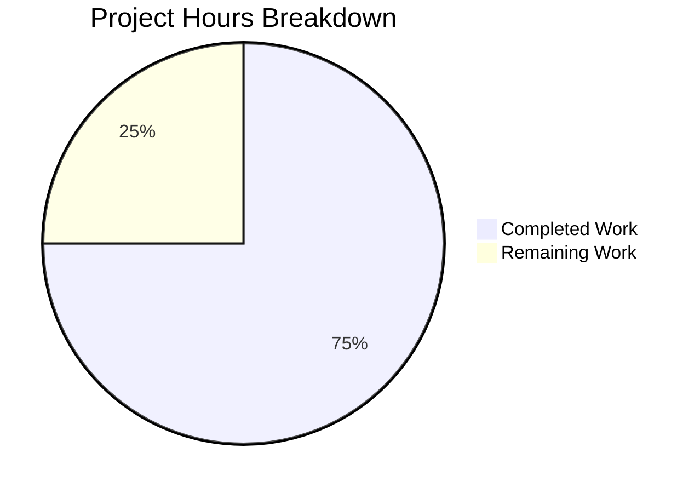

# Project Guide — Express.js Integration for hao-backprop-test

## 1. Executive Summary

**Project Completion: 75% — 6 hours completed out of 8 total hours estimated**

This project integrates the Express.js framework (v5.2.1) into an existing minimal Node.js HTTP server, transitioning from a raw `http.createServer()` catch-all handler to Express route-based request handling. All five in-scope deliverables specified in the Agent Action Plan have been fully implemented, validated, and committed:

1. **server.js** — Rewritten with Express.js app, two GET route handlers (`/` and `/evening`), binding to `127.0.0.1:3000`
2. **package.json** — Updated with `express@^5.2.1` dependency, corrected `main` field, added `start` script
3. **package-lock.json** — Regenerated with complete Express.js transitive dependency tree
4. **.gitignore** — Created to exclude `node_modules/` from version control
5. **README.md** — Comprehensive documentation overhaul with setup instructions and endpoint documentation

**Key Achievements:**
- All AAP-specified deliverables implemented and validated (100% feature completion)
- Both endpoints return correct responses: `GET /` → "Hello, World!\n" and `GET /evening` → "Good evening"
- Zero compilation errors, zero runtime errors, zero vulnerabilities (`npm audit` clean)
- All out-of-scope files confirmed untouched via git diff
- Working tree clean with all changes committed

**Critical Unresolved Issues:** None — all validation passed successfully.

**Remaining Work:** 2 hours of human developer tasks including PR code review/merge, recommended automated test setup, and production readiness review.

---

## 2. Validation Results Summary

### 2.1 Dependency Installation
| Check | Result |
|-------|--------|
| `npm install` | ✅ 66 packages installed successfully |
| Express.js version | ✅ v5.2.1 (latest stable) |
| Vulnerabilities | ✅ 0 vulnerabilities found |
| Node.js compatibility | ✅ v20.19.5 (Express 5 requires 18+) |

### 2.2 Syntax Validation
| Check | Result |
|-------|--------|
| `node -c server.js` | ✅ Passed — zero syntax errors |

### 2.3 Runtime Endpoint Testing
| Endpoint | Expected Response | Actual Response | HTTP Status | Result |
|----------|-------------------|-----------------|-------------|--------|
| `GET /` | `Hello, World!\n` | `Hello, World!\n` | 200 | ✅ Pass |
| `GET /evening` | `Good evening` | `Good evening` | 200 | ✅ Pass |
| `GET /nonexistent` | Express 404 page | Express 404 page | 404 | ✅ Pass |

### 2.4 Server Startup
| Check | Result |
|-------|--------|
| Startup log message | ✅ `Server running at http://127.0.0.1:3000/` (preserved) |
| Bind address | ✅ `127.0.0.1:3000` (preserved) |

### 2.5 File Integrity
| File | Status |
|------|--------|
| LoginTest.java | ✅ Untouched (confirmed via git diff) |
| industry.csv | ✅ Untouched |
| test.blitzyignore.txt | ✅ Untouched |
| test1.blitzyignore.txt | ✅ Untouched |
| test.py.txt | ✅ Untouched |

### 2.6 Fixes Applied During Validation
No fixes were required. All agent-implemented code passed validation on first attempt.

---

## 3. Project Hours Breakdown

### 3.1 Hours Calculation

**Completed: 6 hours** (all AAP deliverables implemented and validated)
- Express.js integration research & version compatibility check: 0.5h
- Express.js dependency installation & lockfile generation: 0.5h
- server.js complete rewrite (Express app, 2 routes, server binding): 1.5h
- package.json modifications (main field, start script, dependencies): 0.5h
- .gitignore creation: 0.25h
- README.md comprehensive documentation overhaul: 1.25h
- Syntax validation & runtime endpoint testing: 1h
- Git branch & commit management: 0.5h

**Remaining: 2 hours** (human developer tasks)
- PR Code Review & Merge Approval: 0.5h
- Automated Endpoint Test Suite Setup (Recommended): 1h
- Production Readiness Review: 0.5h

**Total Project Hours: 6 + 2 = 8 hours**
**Completion: 6 / 8 = 75%**

### 3.2 Visual Representation



---

## 4. Detailed Human Task Table

All remaining tasks for human developers, sorted by priority. **Total remaining hours: 2h** (matches pie chart "Remaining Work" exactly).

| # | Task | Description | Action Steps | Hours | Priority | Severity |
|---|------|-------------|--------------|-------|----------|----------|
| 1 | PR Code Review & Merge | Review all code changes against AAP requirements and merge to target branch | 1. Review `server.js` for Express.js route correctness and response fidelity 2. Verify `package.json` dependency and configuration accuracy 3. Check README.md for documentation completeness 4. Approve and merge PR | 0.5h | High | Required |
| 2 | Automated Endpoint Test Suite | Set up test framework with endpoint tests (recommended — explicitly out of AAP scope but best practice) | 1. Install `jest` and `supertest` as dev dependencies 2. Create `__tests__/server.test.js` with tests for GET / and GET /evening 3. Export app from server.js for supertest usage 4. Update `package.json` test script 5. Run tests to verify | 1h | Medium | Recommended |
| 3 | Production Readiness Review | Verify server behavior in target deployment environment | 1. Deploy to target Node.js environment 2. Run `npm install` and `npm start` 3. Execute `curl` commands against both endpoints 4. Confirm 404 handling for unmatched routes 5. Verify no regressions | 0.5h | Medium | Recommended |
| | **Total Remaining Hours** | | | **2h** | | |

---

## 5. Comprehensive Development Guide

### 5.1 System Prerequisites

| Requirement | Minimum Version | Recommended | Purpose |
|-------------|----------------|-------------|---------|
| Node.js | 18.0.0 | 20.x LTS | Express 5 requires Node.js 18+ |
| npm | 8.x | 10.x+ | Package management |
| curl (optional) | Any | Latest | Endpoint testing |

**Verify prerequisites:**
```bash
node -v    # Must show v18.x.x or higher
npm -v     # Must show 8.x or higher
```

### 5.2 Environment Setup

No environment variables or external services are required. The server runs standalone with hardcoded configuration:
- **Host:** `127.0.0.1`
- **Port:** `3000`

### 5.3 Dependency Installation

From the repository root directory:

```bash
npm install
```

**Expected output:**
```
added 66 packages, and audited 67 packages in Xs
found 0 vulnerabilities
```

**Verify Express.js installation:**
```bash
npm ls express
```

**Expected output:**
```
hello_world@1.0.0
└── express@5.2.1
```

### 5.4 Application Startup

Start the server using either method:

```bash
npm start
```

Or directly:

```bash
node server.js
```

**Expected console output:**
```
Server running at http://127.0.0.1:3000/
```

### 5.5 Verification Steps

With the server running, open a second terminal and test both endpoints:

**Test Hello World endpoint:**
```bash
curl http://127.0.0.1:3000/
```
**Expected response:** `Hello, World!`

**Test Good Evening endpoint:**
```bash
curl http://127.0.0.1:3000/evening
```
**Expected response:** `Good evening`

**Test 404 handling:**
```bash
curl -s -o /dev/null -w "%{http_code}" http://127.0.0.1:3000/nonexistent
```
**Expected response:** `404`

### 5.6 Stopping the Server

Press `Ctrl+C` in the terminal where the server is running.

### 5.7 Troubleshooting

| Issue | Cause | Resolution |
|-------|-------|------------|
| `Error: Cannot find module 'express'` | Dependencies not installed | Run `npm install` |
| `EADDRINUSE: address already in use :::3000` | Port 3000 occupied | Kill the process using port 3000 or stop the other server |
| `node: command not found` | Node.js not installed | Install Node.js 18+ from https://nodejs.org |

---

## 6. Risk Assessment

### 6.1 Technical Risks

| Risk | Severity | Likelihood | Mitigation |
|------|----------|------------|------------|
| Express 5 breaking changes on minor update | Low | Low | Version locked via `package-lock.json`; caret range `^5.2.1` limits to compatible updates |
| No automated tests to catch regressions | Medium | Medium | Recommended: Add endpoint tests using `jest` + `supertest` (see Task #2) |

### 6.2 Security Risks

| Risk | Severity | Likelihood | Mitigation |
|------|----------|------------|------------|
| No security headers (helmet) | Low | Low | Tutorial project on localhost; add `helmet` if exposed to public network |
| No rate limiting | Low | Low | Tutorial project on localhost; add `express-rate-limit` if exposed to public network |
| No input validation on routes | Low | Low | Both routes are simple GET handlers returning static strings; no user input processed |

### 6.3 Operational Risks

| Risk | Severity | Likelihood | Mitigation |
|------|----------|------------|------------|
| No health check endpoint | Low | Low | Add `GET /health` returning 200 if deploying to production with load balancer |
| No logging middleware | Low | Low | Add `morgan` if request logging is needed |
| Hardcoded port and host | Low | Low | Acceptable for tutorial; use `process.env.PORT` for production deployment |

### 6.4 Integration Risks

| Risk | Severity | Likelihood | Mitigation |
|------|----------|------------|------------|
| No integration risks identified | N/A | N/A | Project has no external service dependencies, databases, or third-party APIs |

---

## 7. Git Change Summary

### 7.1 Branch Information
- **Branch:** `blitzy-99b97189-296e-469e-a498-c7fac38568fa`
- **Base:** `origin/13-feb-branch-2`
- **Total commits:** 15
- **Total files changed:** 7 (5 in-scope project files + 2 Blitzy documentation files)
- **Lines added:** 1,576
- **Lines removed:** 13

### 7.2 In-Scope File Changes

| File | Action | Lines Added | Lines Removed | Description |
|------|--------|-------------|---------------|-------------|
| `server.js` | Modified | 13 | 9 | Complete rewrite from http module to Express.js |
| `package.json` | Modified | 7 | 3 | Added dependency, fixed main, added start script |
| `package-lock.json` | Regenerated | 814 | 0 | Full Express.js dependency tree |
| `.gitignore` | Created | 1 | 0 | Excludes node_modules/ |
| `README.md` | Modified | 62 | 1 | Comprehensive documentation overhaul |

### 7.3 Commit History (Feature-Related)
```
a93c5de — chore: install express@^5.2.1 as production dependency
0850f98 — Create .gitignore to exclude node_modules/ from version control
6fed88e — Update package.json: fix main entry point and add start script
26ef1bd — Rewrite server.js from raw http module to Express.js application
025e5ed — Update README.md with comprehensive Express.js documentation
d10f6e2 — Update README.md with Express.js documentation, endpoints, and setup instructions
```
