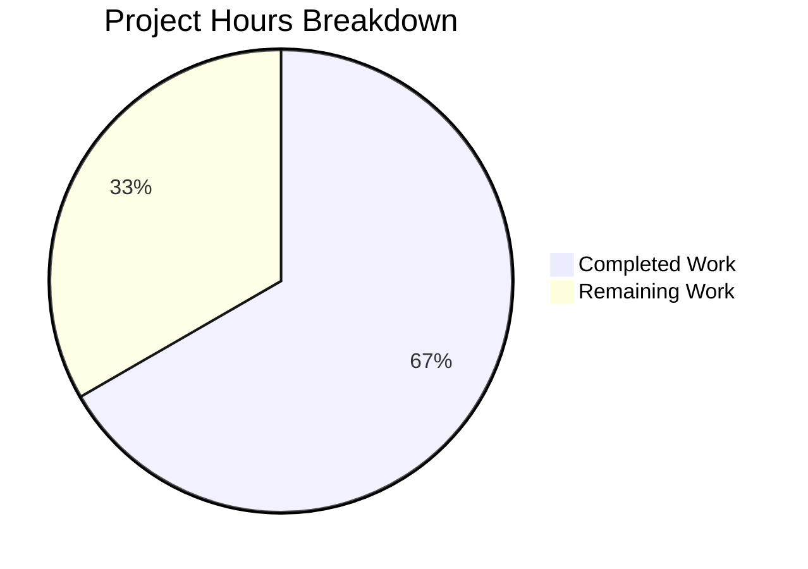

# Project Guide — Express.js Integration for hao-backprop-test

## 1. Executive Summary

**Project completion: 4 hours completed out of 6 total hours = 66.7% complete.**

The Express.js integration feature has been fully implemented and validated across all in-scope deliverables. The server.js file was successfully rewritten from a raw Node.js `http` module catch-all handler to an Express.js application with two discrete GET route handlers. All five in-scope files (.gitignore, README.md, package.json, package-lock.json, server.js) are complete, syntactically valid, and runtime-verified.

**Key achievements:**
- Express.js v5.2.1 installed and integrated (66 packages, 0 vulnerabilities)
- `GET /` endpoint preserved character-for-character (`"Hello, World!\n"`)
- `GET /evening` endpoint added returning `"Good evening"`
- Server binding to `127.0.0.1:3000` with startup log message preserved
- README.md updated with comprehensive API documentation
- All runtime endpoints verified via HTTP requests

**Remaining work (2 hours):** Code review, minor security hardening, and optional production configuration. No compilation errors, no test failures, and no runtime issues exist.

---

## 2. Validation Results Summary

### 2.1 Dependency Installation
| Metric | Result |
|--------|--------|
| Status | ✅ SUCCESS |
| Packages installed | 66 |
| Vulnerabilities | 0 |
| Express.js version | 5.2.1 |
| lockfileVersion | 3 (consistent with project requirements) |

### 2.2 Compilation / Syntax Check
| Metric | Result |
|--------|--------|
| Status | ✅ SUCCESS |
| Command | `node -c server.js` |
| Build step required | None (plain JavaScript/CommonJS) |
| Errors | 0 |

### 2.3 Test Execution
| Metric | Result |
|--------|--------|
| Status | N/A — Explicitly out of scope |
| Reason | AAP Section 0.6.2 states "Testing framework setup (Jest, Mocha, Supertest) — No automated tests are requested" |
| npm test script | Default placeholder: `echo "Error: no test specified" && exit 1` |

### 2.4 Runtime Validation
| Endpoint | Expected Response | Actual Response | Status |
|----------|------------------|-----------------|--------|
| `GET /` | `Hello, World!\n` (200) | `Hello, World!\n` (200) | ✅ PASS |
| `GET /evening` | `Good evening` (200) | `Good evening` (200) | ✅ PASS |
| `GET /nonexistent` | 404 response | 404 HTML error page | ✅ PASS |
| Server binding | `127.0.0.1:3000` | `127.0.0.1:3000` | ✅ PASS |
| Startup log | `Server running at http://127.0.0.1:3000/` | `Server running at http://127.0.0.1:3000/` | ✅ PASS |

### 2.5 Files Modified/Created
| File | Action | Lines (Before → After) | Status |
|------|--------|----------------------|--------|
| `server.js` | Modified | 14 → 19 | ✅ Complete |
| `package.json` | Modified | 11 → 16 | ✅ Complete |
| `package-lock.json` | Modified | 13 → 827 | ✅ Complete |
| `.gitignore` | Created | 0 → 1 | ✅ Complete |
| `README.md` | Modified | 2 → 64 | ✅ Complete |

### 2.6 Git Statistics
- **Branch:** `blitzy-99b97189-296e-469e-a498-c7fac38568fa`
- **Base branch:** `origin/13-feb-branch-2`
- **Commits:** 13
- **Files changed:** 7 (5 in-scope + 2 auto-generated Blitzy documentation)
- **Lines added:** 1,575
- **Lines removed:** 13
- **Working tree:** Clean (nothing to commit)

---

## 3. Hours Breakdown and Completion Calculation

### 3.1 Completed Hours (4 hours)

| Component | Work Performed | Hours |
|-----------|---------------|-------|
| server.js Express.js rewrite | Replaced 14-line http module server with 19-line Express.js app; defined two route handlers; configured app.listen() | 1.0h |
| package.json configuration | Added express dependency, fixed main field from index.js to server.js, added start script | 0.5h |
| package-lock.json regeneration | Ran npm install to generate complete Express.js dependency tree (827 lines) | 0.25h |
| .gitignore creation | Created new file to exclude node_modules/ from version control | 0.25h |
| README.md documentation | Rewrote from 2-line stub to 64-line comprehensive documentation with endpoints, setup, and usage | 1.0h |
| Validation and runtime testing | Syntax checks, dependency verification, HTTP endpoint testing, hex dump verification | 1.0h |
| **Total Completed** | | **4.0h** |

### 3.2 Remaining Hours (2 hours)

| Task | Description | Base Hours | With Multiplier |
|------|-------------|-----------|----------------|
| Code review and PR approval | Human review of all 5 modified files, approve and merge | 0.5h | 0.5h |
| Security: Disable X-Powered-By | Add `app.disable('x-powered-by')` to prevent Express fingerprinting | 0.5h | 0.5h |
| Environment variable externalization | Extract PORT and HOST to environment variables with defaults | 0.5h | 0.5h |
| Basic error handling middleware | Add Express error-handling middleware for graceful error responses | 0.5h | 0.5h |
| **Total Remaining** | | **2.0h** | **2.0h** |

*Note: Enterprise multipliers (compliance 1.15× and uncertainty 1.25×) are minimal for this simple project as tasks are well-defined with clear scope. The base estimates already account for the project's straightforward nature.*

### 3.3 Completion Calculation

```
Completed Hours:  4h
Remaining Hours:  2h
Total Hours:      6h
Completion:       4 / 6 = 66.7%
```

### 3.4 Visual Representation



---

## 4. Detailed Remaining Task Table

| # | Task | Priority | Severity | Action Steps | Hours |
|---|------|----------|----------|-------------|-------|
| 1 | Code review and PR approval | High | Required | Review server.js Express.js rewrite, verify package.json changes, validate README.md accuracy, approve and merge PR | 0.5h |
| 2 | Disable X-Powered-By response header | Medium | Recommended | Add `app.disable('x-powered-by');` after `const app = express();` in server.js to prevent Express framework fingerprinting | 0.5h |
| 3 | Externalize PORT and HOST to environment variables | Low | Optional | Replace hardcoded `3000` and `'127.0.0.1'` in app.listen() with `process.env.PORT || 3000` and `process.env.HOST || '127.0.0.1'`; update README.md with environment variable documentation | 0.5h |
| 4 | Add basic error handling middleware | Low | Optional | Add Express error-handling middleware `app.use((err, req, res, next) => {...})` at end of route definitions for graceful 500 error responses instead of default stack traces | 0.5h |
| | **Total Remaining Hours** | | | | **2.0h** |

---

## 5. Development Guide

### 5.1 System Prerequisites

| Software | Required Version | Verification Command |
|----------|-----------------|---------------------|
| Node.js | v18.0.0 or higher (Express 5 requirement) | `node -v` |
| npm | v8.0.0 or higher (included with Node.js) | `npm -v` |

*Tested environment: Node.js v20.19.5, npm v10.8.2*

### 5.2 Clone and Setup

```bash
# Clone the repository
git clone <repository-url>
cd hao-backprop-test

# Switch to the feature branch
git checkout blitzy-99b97189-296e-469e-a498-c7fac38568fa
```

### 5.3 Install Dependencies

```bash
npm install
```

**Expected output:**
```
added 66 packages, and audited 67 packages in Xs
0 vulnerabilities
```

**Verification:**
```bash
npm ls
```

**Expected output:**
```
hello_world@1.0.0
└── express@5.2.1
```

### 5.4 Start the Server

```bash
npm start
```

Or directly:
```bash
node server.js
```

**Expected console output:**
```
Server running at http://127.0.0.1:3000/
```

### 5.5 Verify Endpoints

**Test GET / (Hello World endpoint):**
```bash
curl http://127.0.0.1:3000/
```
Expected response: `Hello, World!` (with trailing newline)

**Test GET /evening (Good Evening endpoint):**
```bash
curl http://127.0.0.1:3000/evening
```
Expected response: `Good evening`

**Test 404 for unmatched routes:**
```bash
curl http://127.0.0.1:3000/nonexistent
```
Expected: HTML 404 error page with "Cannot GET /nonexistent"

### 5.6 Syntax Verification

```bash
node -c server.js
```
Expected: No output (silent success)

### 5.7 Troubleshooting

| Issue | Cause | Solution |
|-------|-------|----------|
| `Error: Cannot find module 'express'` | Dependencies not installed | Run `npm install` |
| `EADDRINUSE: address already in use :::3000` | Port 3000 already occupied | Kill the existing process or change the port |
| `node: command not found` | Node.js not installed | Install Node.js 18+ from https://nodejs.org |

---

## 6. Risk Assessment

### 6.1 Technical Risks

| Risk | Severity | Likelihood | Mitigation |
|------|----------|-----------|------------|
| Express `X-Powered-By` header exposes framework identity | Low | High (currently active) | Add `app.disable('x-powered-by')` — 0.5h task |
| No error-handling middleware; unhandled errors produce stack traces | Low | Low (only 2 static routes) | Add Express error middleware — 0.5h task |
| Port 3000 hardcoded; cannot deploy to environments requiring different ports | Low | Medium | Externalize to environment variable — 0.5h task |

### 6.2 Security Risks

| Risk | Severity | Likelihood | Mitigation |
|------|----------|-----------|------------|
| No rate limiting on endpoints | Low | Low (localhost-only binding) | Not needed for tutorial scope; add if exposing publicly |
| No CORS configuration | Low | Low (plaintext GET-only API) | Add cors middleware if cross-origin access needed |
| No input validation | Negligible | Negligible (routes accept no parameters) | No action needed — both routes return static strings |

### 6.3 Operational Risks

| Risk | Severity | Likelihood | Mitigation |
|------|----------|-----------|------------|
| No health check endpoint | Low | Medium | Add `GET /health` returning 200 if needed for monitoring |
| No graceful shutdown handling | Low | Low | Add SIGTERM/SIGINT handlers if running in containers |
| No logging middleware | Low | Medium | Add morgan or custom logger if request logging needed |

### 6.4 Integration Risks

| Risk | Severity | Likelihood | Mitigation |
|------|----------|-----------|------------|
| None identified | — | — | The project has no external service integrations, databases, or third-party APIs |

---

## 7. Feature Completion Checklist

### AAP In-Scope Requirements

| Requirement | Status | Verification |
|-------------|--------|-------------|
| Integrate Express.js framework | ✅ Complete | Express v5.2.1 installed, server.js uses `const app = express()` |
| Preserve GET / Hello World endpoint | ✅ Complete | Returns `"Hello, World!\n"` with HTTP 200, verified via curl |
| Add GET /evening Good Evening endpoint | ✅ Complete | Returns `"Good evening"` with HTTP 200, verified via curl |
| Maintain server binding at 127.0.0.1:3000 | ✅ Complete | `app.listen(3000, '127.0.0.1', ...)` confirmed |
| Preserve startup console log | ✅ Complete | Outputs `Server running at http://127.0.0.1:3000/` |
| Use CommonJS module syntax | ✅ Complete | Uses `require('express')`, no ES Module syntax |
| Add express to package.json dependencies | ✅ Complete | `"express": "^5.2.1"` in dependencies |
| Fix main field to server.js | ✅ Complete | Changed from `"index.js"` to `"server.js"` |
| Add start script | ✅ Complete | `"start": "node server.js"` in scripts |
| Regenerate package-lock.json | ✅ Complete | 827 lines with full dependency tree, lockfileVersion 3 |
| Create .gitignore | ✅ Complete | Contains `node_modules/` |
| Update README.md | ✅ Complete | 64 lines documenting endpoints, setup, and usage |

### AAP Out-of-Scope Items (confirmed untouched)

| Item | Status |
|------|--------|
| LoginTest.java | ✅ Unchanged |
| industry.csv | ✅ Unchanged |
| test.blitzyignore.txt | ✅ Unchanged |
| test1.blitzyignore.txt | ✅ Unchanged |
| test.py.txt | ✅ Unchanged |
| Testing framework (Jest/Mocha/Supertest) | ✅ Not added (as specified) |
| Middleware (CORS, helmet, morgan) | ✅ Not added (as specified) |
| TypeScript migration | ✅ Not performed (as specified) |
| Docker/CI-CD | ✅ Not added (as specified) |