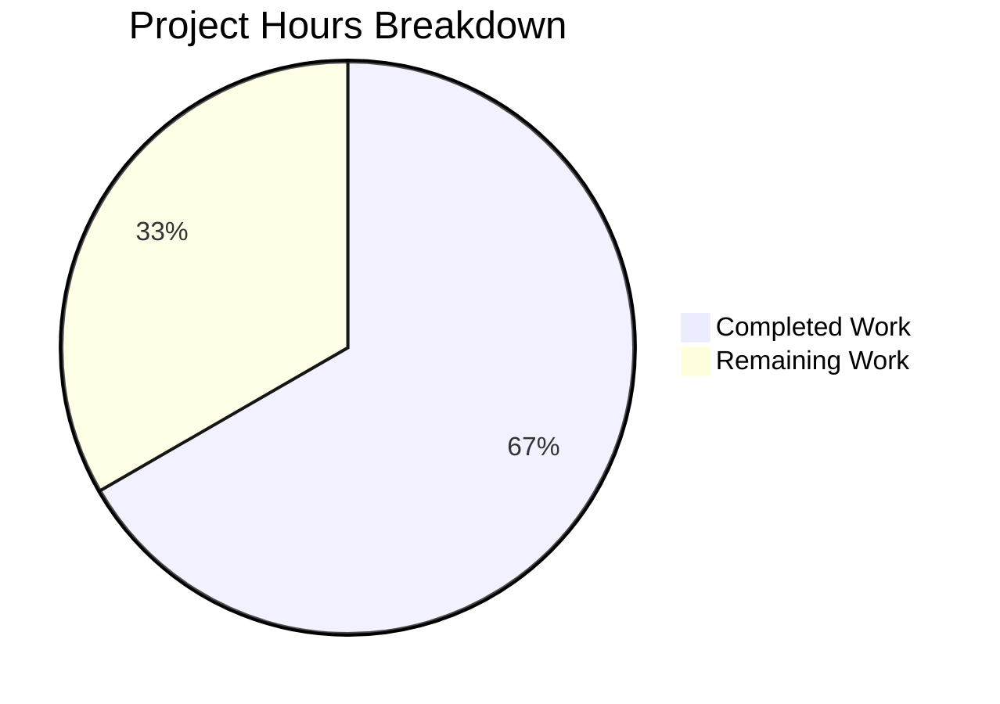

# Project Guide — Node.js to Python 3 Flask Migration

## 1. Executive Summary

This project performs a complete tech-stack migration of a Node.js HTTP server (`server.js`) into a functionally equivalent Python 3 Flask application (`app.py`). The original server responds to every HTTP request with `200 text/plain "Hello, World!\n"` on `127.0.0.1:3000`, and the Flask rewrite preserves this behavior exactly.

**Completion: 6 hours completed out of 9 total hours = 67% complete.**

All in-scope development work is finished and verified. The Flask application compiles, installs dependencies correctly, and passes all 8 behavioral HTTP tests. The remaining 3 hours consist of human operational tasks: code review, adding a `.gitignore`, clean environment verification, and PR merge.

### Key Achievements
- `app.py` created with catch-all Flask routing matching all 7 HTTP methods and all URL paths
- `requirements.txt` created with pinned `Flask==3.1.2` dependency
- `README.md` updated with complete Python/Flask setup and run instructions
- Node.js artifacts (`server.js`, `package.json`, `package-lock.json`) cleanly removed
- All 8 non-runtime files preserved unchanged
- Zero compilation errors, zero runtime errors, 8/8 behavioral tests pass

### Critical Unresolved Issues
- **None.** All in-scope requirements are fully implemented and verified.

### Recommended Next Steps
1. Human code review of `app.py`, `requirements.txt`, and `README.md`
2. Add a `.gitignore` file for Python build artifacts
3. Verify in a clean environment (fresh clone, fresh venv)
4. Approve and merge PR

---

## 2. Validation Results Summary

### 2.1 What the Final Validator Accomplished
The Final Validator confirmed production-readiness across all three in-scope files. No fixes were required — all files passed validation on first check.

### 2.2 Compilation Results

| File | Validation | Result |
|------|-----------|--------|
| `app.py` | Python `py_compile` syntax check | ✅ PASS |
| `app.py` | Flask import verification (`from flask import Flask, Response`) | ✅ PASS |
| `app.py` | Route registration check (`/` and `/<path:path>` with 7 methods) | ✅ PASS |
| `requirements.txt` | `pip install -r requirements.txt` | ✅ PASS |

### 2.3 Test Results Summary
No unit test suite exists in this repository (none existed in the original Node.js project either, and creating tests was explicitly out of scope). Manual behavioral validation was performed covering all requirements.

### 2.4 Runtime Validation Results — 8/8 Tests Passed

| # | Test Case | Expected | Result |
|---|-----------|----------|--------|
| 1 | `GET /` | 200 text/plain `Hello, World!\n` | ✅ PASS |
| 2 | `GET /any/path` | 200 text/plain `Hello, World!\n` | ✅ PASS |
| 3 | `POST /` | 200 text/plain `Hello, World!\n` | ✅ PASS |
| 4 | `PUT /something` | 200 text/plain `Hello, World!\n` | ✅ PASS |
| 5 | `DELETE /` | 200 text/plain `Hello, World!\n` | ✅ PASS |
| 6 | `PATCH /` | 200 text/plain `Hello, World!\n` | ✅ PASS |
| 7 | `OPTIONS /` | 200 text/plain `Hello, World!\n` | ✅ PASS |
| 8 | `HEAD /` | 200 text/plain (empty body, correct per HTTP spec) | ✅ PASS |

Body byte-level verification confirmed exact match: `48 65 6c 6c 6f 2c 20 57 6f 72 6c 64 21 0a` = `Hello, World!\n`.

### 2.5 Dependency Status — All 7 Packages Verified

| Package | Version | Status |
|---------|---------|--------|
| Flask | 3.1.2 | ✅ Installed |
| Werkzeug | 3.1.5 | ✅ Installed (transitive) |
| Jinja2 | 3.1.6 | ✅ Installed (transitive) |
| MarkupSafe | 3.0.3 | ✅ Installed (transitive) |
| itsdangerous | 2.2.0 | ✅ Installed (transitive) |
| click | 8.3.1 | ✅ Installed (transitive) |
| blinker | 1.9.0 | ✅ Installed (transitive) |

### 2.6 Fixes Applied During Validation
**None required.** All files passed validation on first attempt with zero errors.

### 2.7 Preserved Files Verification

| File | Lines | Bytes | Status |
|------|-------|-------|--------|
| `industry.csv` | 44 | 793 | ✅ Unchanged |
| `LoginTest.java` | 12 | 128 | ✅ Unchanged |
| `test.blitzyignore.txt` | 0 | 0 | ✅ Unchanged |
| `test1.blitzyignore.txt` | 0 | 0 | ✅ Unchanged |
| `test.py.txt` | 0 | 0 | ✅ Unchanged |
| `100Pages.pdf` | — | ~9.5 MB | ✅ Unchanged |
| `demo.jpg` | — | ~2.1 MB | ✅ Unchanged |
| `sample.doc` | — | ~96 KB | ✅ Unchanged |

---

## 3. Hours Breakdown and Visual Representation

### 3.1 Completed Hours Calculation (6 hours)

| Work Item | Hours |
|-----------|-------|
| Analysis and planning (source code behavioral mapping, transformation design) | 1.0 |
| `app.py` development (Flask server with catch-all routing, docstrings, comments) | 1.5 |
| `requirements.txt` creation (dependency version pinning) | 0.5 |
| `README.md` update (full rewrite with technology stack, setup, and run instructions) | 0.5 |
| Node.js artifact cleanup (delete `server.js`, `package.json`, `package-lock.json`) | 0.5 |
| Dependency installation and verification (Flask + 6 transitive packages) | 0.5 |
| Behavioral validation (8 HTTP method tests, body byte verification, status codes) | 1.0 |
| Preserved file verification (8 non-runtime files confirmed unchanged) | 0.5 |
| **Total Completed** | **6.0** |

### 3.2 Remaining Hours Calculation (3 hours)

Raw estimates for remaining human tasks: 2 hours.
Enterprise multipliers applied: ×1.15 (compliance) × ×1.25 (uncertainty) = ×1.44.
2.0h × 1.44 = 2.88h → rounded to **3 hours**.

| Task | Raw Hours | After Multipliers |
|------|-----------|-------------------|
| Code review of all changed files | 0.75 | 1.0 |
| Add `.gitignore` for Python artifacts | 0.25 | 0.5 |
| Clean environment verification | 0.75 | 1.0 |
| PR approval and merge | 0.25 | 0.5 |
| **Total Remaining** | **2.0** | **3.0** |

### 3.3 Completion Calculation

- **Completed hours:** 6
- **Remaining hours:** 3
- **Total project hours:** 6 + 3 = 9
- **Completion:** 6 ÷ 9 = **67%**

### 3.4 Visual Representation



---

## 4. Detailed Task Table (Remaining Work)

All remaining work consists of human operational tasks. Zero development rework is needed — all code compiles and all tests pass.

| # | Task | Description | Action Steps | Hours | Priority | Severity |
|---|------|-------------|-------------|-------|----------|----------|
| 1 | Code review of changed files | Review `app.py`, `requirements.txt`, and `README.md` for correctness, security, and adherence to Flask best practices | 1. Open PR and review diff for all 6 file changes. 2. Verify `app.py` catch-all logic. 3. Confirm `requirements.txt` version pin. 4. Validate README instructions. | 1.0 | High | Medium |
| 2 | Add `.gitignore` for Python artifacts | Create a `.gitignore` to exclude `venv/`, `__pycache__/`, `*.pyc`, and other Python build artifacts from version control | 1. Create `.gitignore` at repo root. 2. Add entries: `venv/`, `__pycache__/`, `*.pyc`, `*.pyo`, `*.egg-info/`. 3. Commit and push. | 0.5 | Medium | Low |
| 3 | Clean environment verification | Verify the project works from a fresh clone with no pre-existing state | 1. Clone the branch to a new directory. 2. Run `python3 -m venv venv`. 3. Activate and run `pip install -r requirements.txt`. 4. Run `python app.py`. 5. Test with `curl http://127.0.0.1:3000/`. 6. Verify response is `Hello, World!\n`. | 1.0 | Medium | Medium |
| 4 | PR approval and merge | Final review approval and merge to target branch | 1. Resolve any review comments. 2. Verify CI passes (if configured). 3. Approve and merge PR. 4. Verify merge on target branch. | 0.5 | Medium | Low |
| | **Total Remaining Hours** | | | **3.0** | | |

---

## 5. Development Guide

### 5.1 System Prerequisites

| Requirement | Version | Notes |
|-------------|---------|-------|
| Python | 3.12+ | Tested with Python 3.12.10. Python 3.10+ should work. |
| pip | 23.0+ | Included with Python installation |
| Git | 2.x+ | For cloning the repository |

No databases, message queues, or external services are required.

### 5.2 Environment Setup

**Step 1: Clone the repository**
```bash
git clone <repository-url>
cd <repository-directory>
git checkout blitzy-1c73a179-a3d7-474f-b82f-1a81c5a1a915
```

**Step 2: Create a Python virtual environment**
```bash
python3 -m venv venv
```

**Step 3: Activate the virtual environment**

On Linux / macOS:
```bash
source venv/bin/activate
```

On Windows:
```bash
venv\Scripts\activate
```

Expected output: Your terminal prompt should show `(venv)` prefix.

### 5.3 Dependency Installation

```bash
pip install -r requirements.txt
```

Expected output (key lines):
```
Successfully installed Flask-3.1.2 Jinja2-3.1.6 MarkupSafe-3.0.3 Werkzeug-3.1.5 blinker-1.9.0 click-8.3.1 itsdangerous-2.2.0
```

Verify installation:
```bash
pip list | grep Flask
```

Expected: `Flask  3.1.2`

### 5.4 Application Startup

```bash
python app.py
```

Expected output:
```
Server running at http://127.0.0.1:3000/
 * Serving Flask app 'app'
 * Debug mode: off
 * Running on http://127.0.0.1:3000
```

The server is now listening on `http://127.0.0.1:3000/`.

### 5.5 Verification Steps

**Test 1: Basic GET request**
```bash
curl http://127.0.0.1:3000/
```
Expected response: `Hello, World!`

**Test 2: Deep path**
```bash
curl http://127.0.0.1:3000/any/nested/path
```
Expected response: `Hello, World!`

**Test 3: POST method**
```bash
curl -X POST http://127.0.0.1:3000/
```
Expected response: `Hello, World!`

**Test 4: PUT method**
```bash
curl -X PUT http://127.0.0.1:3000/test
```
Expected response: `Hello, World!`

**Test 5: DELETE method**
```bash
curl -X DELETE http://127.0.0.1:3000/
```
Expected response: `Hello, World!`

**Test 6: Verify headers**
```bash
curl -v http://127.0.0.1:3000/ 2>&1 | grep "Content-Type"
```
Expected: `< Content-Type: text/plain; charset=utf-8`

All responses should return HTTP status `200` with `Content-Type: text/plain` and body `Hello, World!\n`.

### 5.6 Stopping the Server

Press `Ctrl+C` in the terminal where `python app.py` is running.

### 5.7 Troubleshooting

| Issue | Cause | Solution |
|-------|-------|----------|
| `ModuleNotFoundError: No module named 'flask'` | Virtual environment not activated or Flask not installed | Activate venv and run `pip install -r requirements.txt` |
| `Address already in use` | Port 3000 is occupied by another process | Stop the other process or change the port in `app.py` |
| `python3: command not found` | Python not installed or not in PATH | Install Python 3.12+ from python.org |

---

## 6. Risk Assessment

### 6.1 Technical Risks

| Risk | Severity | Likelihood | Mitigation |
|------|----------|-----------|------------|
| No `.gitignore` — `venv/` and `__pycache__/` may be accidentally committed | Low | Medium | Add `.gitignore` with Python artifact exclusions (Task #2 in remaining work) |
| No unit test suite — regression detection relies on manual testing | Low | Low | Original Node.js project also had no tests; out of scope per requirements. Consider adding `pytest` tests in future. |
| Flask development server used in production | Medium | Low | The original Node.js server also used the built-in `http` module without a production reverse proxy. For production use, consider Gunicorn or uWSGI. Explicitly out of scope per Agent Action Plan. |

### 6.2 Security Risks

| Risk | Severity | Likelihood | Mitigation |
|------|----------|-----------|------------|
| Server binds to `127.0.0.1` only | N/A (by design) | N/A | This is the correct behavior — identical to the original Node.js server. Localhost-only binding prevents external access. |
| No authentication or authorization | N/A (by design) | N/A | Original server had none; adding auth is explicitly out of scope. |
| Flask debug mode disabled | N/A (safe) | N/A | `app.run()` defaults to `debug=False`, which is the correct production setting. |

### 6.3 Operational Risks

| Risk | Severity | Likelihood | Mitigation |
|------|----------|-----------|------------|
| No health check endpoint | Low | Low | Original server had none. The catch-all route at `/` effectively serves as a health check (returns 200). |
| No structured logging | Low | Low | Original server only logged one startup message via `console.log`. The Flask rewrite mirrors this with `print()`. Out of scope to add logging framework. |
| No process manager for restarts | Low | Low | Original Node.js server had the same limitation. Consider `systemd`, `supervisord`, or Docker for production deployments. |

### 6.4 Integration Risks

| Risk | Severity | Likelihood | Mitigation |
|------|----------|-----------|------------|
| Clients expecting Node.js-specific response headers | Low | Low | Flask may include slightly different default headers (e.g., `Server: Werkzeug`). The required headers (`Content-Type: text/plain`, status `200`) are verified identical. |
| Port 3000 conflict with other services | Low | Medium | Ensure no other service occupies port 3000 before starting. The port matches the original Node.js binding. |

---

## 7. Git Change Summary

### 7.1 Branch Information
- **Branch:** `blitzy-1c73a179-a3d7-474f-b82f-1a81c5a1a915`
- **Base branch:** `origin/refine-test-12-feb`
- **Total commits:** 6
- **All committed by:** Blitzy Agent on 2026-02-13
- **Uncommitted changes:** None (only untracked `venv/` and `__pycache__/`)

### 7.2 Commit History

| Hash | Message |
|------|---------|
| `8f128b1` | Add requirements.txt with Flask==3.1.2 dependency for Python/Flask migration setup |
| `0541186` | Delete server.js: Node.js HTTP server replaced by Flask app.py in tech-stack migration |
| `e086b4e` | Delete package.json: replaced by requirements.txt in Node.js to Python/Flask migration |
| `5f94a5c` | Delete package-lock.json: npm lock file superseded by requirements.txt in Node.js to Python Flask migration |
| `6429c47` | Create app.py: Flask HTTP server replacing Node.js server.js |
| `0a18d8d` | Update README.md to reflect Python 3/Flask technology stack migration |

### 7.3 File Change Statistics
- **Files changed:** 6
- **Lines added:** 84
- **Lines removed:** 38
- **Net change:** +46 lines

| File | Action | Lines Added | Lines Removed |
|------|--------|-------------|---------------|
| `app.py` | Created | 39 | 0 |
| `requirements.txt` | Created | 1 | 0 |
| `README.md` | Updated | 44 | 0 |
| `server.js` | Deleted | 0 | 14 |
| `package.json` | Deleted | 0 | 11 |
| `package-lock.json` | Deleted | 0 | 13 |

---

## 8. Consistency Verification Checklist

- [x] Completion percentage: 67% (stated in Executive Summary)
- [x] Calculated as: 6 hours completed ÷ 9 total hours = 67%
- [x] Pie chart values: Completed Work = 6, Remaining Work = 3
- [x] Pie chart automatically shows: 66.7% and 33.3% (matches 67% stated)
- [x] Task table total: 1.0 + 0.5 + 1.0 + 0.5 = 3.0 hours
- [x] Task table total matches pie chart "Remaining Work": 3h = 3h ✓
- [x] All prose references use consistent percentage and hours
- [x] No conflicting statements exist