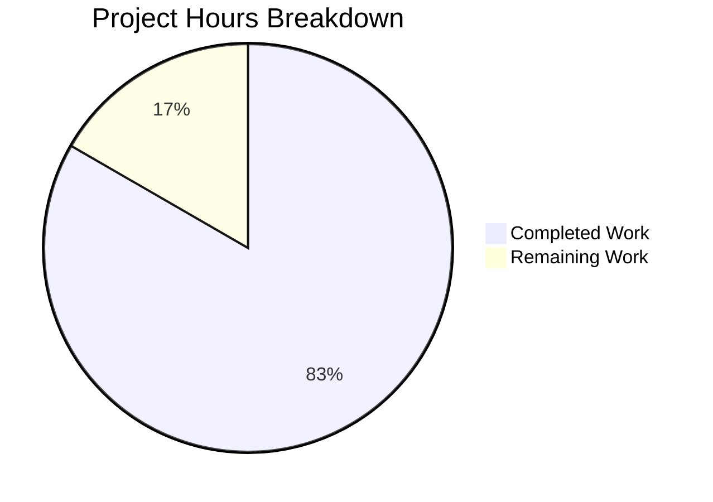

# Project Guide — Express.js Integration for hao-backprop-test

## 1. Executive Summary

**Project Completion: 83% (5 hours completed out of 6 total hours)**

This project integrates Express.js v5.2.1 into an existing minimal Node.js HTTP server, replacing the raw `http.createServer()` pattern with Express.js route-based handling. All in-scope deliverables have been implemented, validated, and verified at runtime with zero errors.

**Completion Calculation:**
- Completed: 5 hours (research, implementation, configuration, documentation, validation)
- Remaining: 1 hour (human code review and PR merge/verification)
- Total: 6 hours
- Completion: 5 / 6 = 83%

### Key Achievements
- Express.js v5.2.1 successfully installed as sole production dependency (0 vulnerabilities)
- `server.js` rewritten with two Express.js GET route handlers (`/` and `/evening`)
- Original "Hello, World!\n" response preserved character-for-character
- New "Good evening" endpoint operational at `/evening`
- Server binding preserved at `127.0.0.1:3000` with identical startup log
- `package.json` corrected (`main` field, `start` script, dependency declaration)
- `.gitignore` created for `node_modules/` exclusion
- `README.md` updated with comprehensive endpoint documentation
- All runtime tests passed (200 for defined routes, 404 for undefined routes)

### Critical Issues: None
All five in-scope files compile, run, and produce correct output. Zero errors across all validation gates.

---

## 2. Validation Results Summary

### 2.1 What Was Accomplished

The Blitzy agents performed the following work across 7 feature commits:

| Commit | Description |
|--------|-------------|
| `a93c5de` | Installed `express@^5.2.1` as production dependency |
| `0850f98` | Created `.gitignore` to exclude `node_modules/` |
| `6fed88e` | Updated `package.json`: fixed `main` to `server.js`, added `start` script |
| `26ef1bd` | Rewrote `server.js` from raw `http` module to Express.js application |
| `025e5ed` | Updated README.md with comprehensive Express.js documentation |
| `6bb93fc` | Minor README.md update |
| `d10f6e2` | Final README.md documentation with endpoints and setup instructions |

### 2.2 Files Changed

| File | Action | Lines Added | Lines Removed | Status |
|------|--------|-------------|---------------|--------|
| `server.js` | MODIFIED | 13 | 9 | ✅ Complete |
| `package.json` | MODIFIED | 7 | 3 | ✅ Complete |
| `package-lock.json` | REGENERATED | 814 | 0 | ✅ Complete |
| `.gitignore` | CREATED | 1 | 0 | ✅ Complete |
| `README.md` | MODIFIED | 62 | 1 | ✅ Complete |

**Total: 897 lines added, 13 lines removed across 5 in-scope files.**

### 2.3 Compilation Results

| Check | Command | Result |
|-------|---------|--------|
| JavaScript syntax | `node -c server.js` | ✅ Passed |
| Dependency install | `npm install` | ✅ 66 packages, 0 vulnerabilities |
| Security audit | `npm audit` | ✅ 0 vulnerabilities |

### 2.4 Runtime Validation Results

| Test | Command | Expected | Actual | Status |
|------|---------|----------|--------|--------|
| Hello World endpoint | `curl http://127.0.0.1:3000/` | `Hello, World!\n` (200) | `Hello, World!\n` (200) | ✅ Pass |
| Good evening endpoint | `curl http://127.0.0.1:3000/evening` | `Good evening` (200) | `Good evening` (200) | ✅ Pass |
| Unknown route handling | `curl http://127.0.0.1:3000/unknown` | 404 response | 404 response | ✅ Pass |
| Startup log message | Server console output | `Server running at http://127.0.0.1:3000/` | `Server running at http://127.0.0.1:3000/` | ✅ Pass |

### 2.5 Out-of-Scope Files Verified Untouched

| File | Status |
|------|--------|
| `LoginTest.java` | ✅ Present, unmodified |
| `industry.csv` | ✅ Present, unmodified |
| `test.blitzyignore.txt` | ✅ Present, unmodified |
| `test1.blitzyignore.txt` | ✅ Present, unmodified |
| `test.py.txt` | ✅ Present, unmodified |

### 2.6 Fixes Applied During Validation

No fixes were required during validation. All in-scope files passed every validation gate on the first check.

---

## 3. Hours Breakdown

### 3.1 Completed Hours (5 hours)

| Component | Hours | Details |
|-----------|-------|---------|
| Express.js research & version selection | 0.5 | Verified v5.2.1 compatibility with Node.js v20, CommonJS support, breaking changes review |
| server.js rewrite | 1.5 | Replaced `http.createServer()` with Express.js app; implemented 2 route handlers; preserved binding and startup log |
| package.json configuration | 0.5 | Added express dependency, corrected `main` field, added `start` script |
| .gitignore creation | 0.25 | Created version control exclusion for `node_modules/` |
| README.md documentation | 1.0 | Wrote comprehensive 63-line documentation with endpoints table, setup instructions, and curl examples |
| Validation & runtime testing | 1.25 | Syntax checking, dependency installation, npm audit, server startup, curl endpoint verification |
| **Total Completed** | **5.0** | |

### 3.2 Remaining Hours (1 hour)

| Task | Hours | Details |
|------|-------|---------|
| Human code review and approval | 0.5 | Review all 5 modified files for correctness, style, and AAP compliance |
| PR merge and target environment verification | 0.5 | Merge to target branch, verify `npm install` and endpoint responses in target environment |
| **Total Remaining** | **1.0** | |

### 3.3 Visual Representation



**Verification: 5 completed / (5 + 1) total = 5/6 = 83% complete ✓**

---

## 4. Detailed Task Table — Remaining Human Work

| # | Task | Description | Action Steps | Hours | Priority | Severity |
|---|------|-------------|--------------|-------|----------|----------|
| 1 | Code review and approval | Review all changes for correctness, style consistency, and AAP compliance | 1. Review `server.js` route handlers and Express.js usage 2. Verify `package.json` dependency and metadata 3. Check `.gitignore` and `README.md` completeness 4. Approve PR | 0.5 | High | Medium |
| 2 | PR merge and environment verification | Merge PR to target branch and verify functionality in the deployment environment | 1. Merge PR 2. Run `npm install` in target environment 3. Run `npm start` and test both endpoints with `curl` 4. Confirm 404 behavior for unknown routes | 0.5 | High | Medium |
| | **Total Remaining Hours** | | | **1.0** | | |

**Consistency check: Task table total (1.0h) = Pie chart "Remaining Work" (1) ✓**

---

## 5. Development Guide

### 5.1 System Prerequisites

| Requirement | Minimum Version | Verified Version |
|-------------|----------------|-----------------|
| Node.js | 18.0.0+ | v20.19.5 |
| npm | 8.0.0+ | v10.8.2 |
| Operating System | Any (Windows, macOS, Linux) | Windows (validated) |

### 5.2 Environment Setup

No environment variables are required. The server uses hardcoded values per the project specification:
- **Host:** `127.0.0.1`
- **Port:** `3000`

### 5.3 Dependency Installation

From the repository root directory:

```bash
cd /tmp/blitzy/Repo-for-qa-refine-test-12-feb/blitzy99b971892
npm install
```

**Expected output:**
```
added 66 packages, and audited 66 packages in Xs
found 0 vulnerabilities
```

### 5.4 Application Startup

Start the server using either method:

```bash
npm start
```

Or directly:

```bash
node server.js
```

**Expected console output:**
```
Server running at http://127.0.0.1:3000/
```

### 5.5 Verification Steps

With the server running, open a separate terminal and run:

```bash
# Test Hello World endpoint
curl http://127.0.0.1:3000/
# Expected: Hello, World!

# Test Good Evening endpoint
curl http://127.0.0.1:3000/evening
# Expected: Good evening

# Test 404 handling for unknown routes
curl -s -o /dev/null -w "%{http_code}" http://127.0.0.1:3000/unknown
# Expected: 404
```

### 5.6 Stopping the Server

Press `Ctrl+C` in the terminal running the server.

### 5.7 Troubleshooting

| Issue | Cause | Resolution |
|-------|-------|------------|
| `Error: Cannot find module 'express'` | Dependencies not installed | Run `npm install` |
| `EADDRINUSE: address already in use` | Port 3000 already occupied | Stop the other process on port 3000 or change the port in `server.js` |
| `node: command not found` | Node.js not installed | Install Node.js 18+ from https://nodejs.org |

---

## 6. Risk Assessment

### 6.1 Technical Risks

| Risk | Severity | Likelihood | Mitigation |
|------|----------|------------|------------|
| Express.js v5 is relatively new (released Oct 2024) | Low | Low | v5.2.1 is stable; can pin to exact version in package.json if needed |
| No automated test suite | Low | N/A | Explicitly out of scope per AAP; runtime validation performed manually |

### 6.2 Security Risks

| Risk | Severity | Likelihood | Mitigation |
|------|----------|------------|------------|
| No security middleware (helmet, CORS, rate limiting) | Low | Low | Out of scope per AAP; appropriate for localhost tutorial project |
| npm audit shows 0 vulnerabilities | None | N/A | Current dependency tree is clean; monitor with periodic `npm audit` |

### 6.3 Operational Risks

| Risk | Severity | Likelihood | Mitigation |
|------|----------|------------|------------|
| Hardcoded host/port (no env var configuration) | Low | Low | Intentional per AAP; acceptable for tutorial project scope |
| No process manager (PM2, forever) | Low | Low | Out of scope; `node server.js` is sufficient for tutorial use |

### 6.4 Integration Risks

| Risk | Severity | Likelihood | Mitigation |
|------|----------|------------|------------|
| No external integrations to break | None | N/A | Project is self-contained with no external service dependencies |

**Overall Risk Assessment: LOW** — This is a minimal tutorial project with a clean dependency tree, zero vulnerabilities, and no external integrations. All identified risks are low severity and appropriate for the project's scope.

---

## 7. Appendix — Verified File Contents

### server.js (18 lines)
Express.js application with two GET route handlers:
- `GET /` → `"Hello, World!\n"` (200)
- `GET /evening` → `"Good evening"` (200)
- Listens on `127.0.0.1:3000`

### package.json (15 lines)
- `name`: hello_world, `version`: 1.0.0
- `main`: server.js (corrected from index.js)
- `scripts.start`: node server.js
- `dependencies.express`: ^5.2.1

### .gitignore (1 line)
- Excludes `node_modules/`

### README.md (63 lines)
- Project description, prerequisites, installation, usage, endpoint documentation, license

### package-lock.json (814 lines)
- lockfileVersion 3, 66 packages in Express.js dependency tree