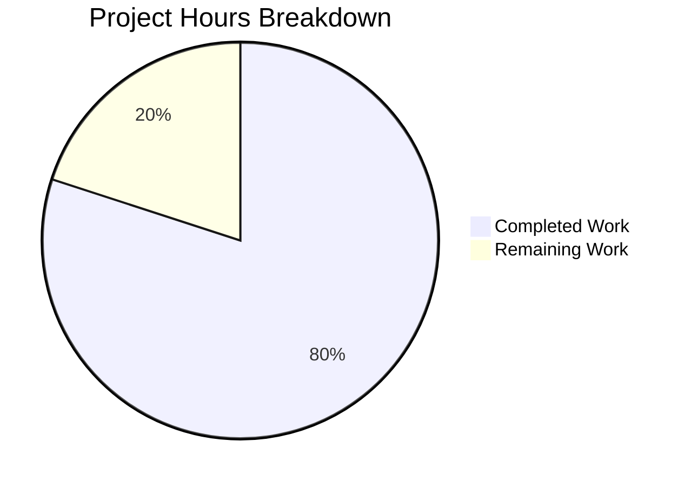

# Project Guide: Express.js Integration for hao-backprop-test

## 1. Executive Summary

**Project Completion: 80% — 4 hours completed out of 5 total hours required.**

This project integrates the Express.js framework (v5.2.1) into an existing minimal Node.js HTTP server, replacing the raw `http.createServer()` pattern with Express.js route-based request handling. A new `/evening` endpoint was added alongside the preserved Hello World endpoint.

### Key Achievements
- Complete architectural migration from raw `http` module to Express.js application
- Two functional GET endpoints: `/` (Hello, World!\n) and `/evening` (Good evening)
- All 5 planned files created/modified per Agent Action Plan
- Full runtime validation passed — both endpoints return correct responses
- Zero compilation errors, zero dependency vulnerabilities
- Comprehensive README.md documentation with API reference

### What Remains (1 hour)
- Human code review and merge approval (0.5h)
- Production environment deployment verification (0.5h)

---

## 2. Validation Results Summary

### 2.1 Final Validator Outcome: PRODUCTION-READY

The Final Validator agent completed comprehensive validation with all checks passing. No issues were found and no fixes were required — all files were correctly implemented by prior agents.

### 2.2 Dependency Installation
- **Status**: ✅ PASS
- **Details**: `npm install` completed successfully — 66 packages installed, 0 vulnerabilities
- **Express.js Version**: 5.2.1 (latest stable, compatible with Node.js v20.19.5)
- **Audit**: `npm audit` reports 0 vulnerabilities

### 2.3 Compilation / Syntax Check
- **Status**: ✅ PASS
- **Details**: `node -c server.js` syntax check passed with zero errors

### 2.4 Runtime Validation
| Test | Expected | Actual | Status |
|------|----------|--------|--------|
| Server startup | Console: "Server running at http://127.0.0.1:3000/" | Exact match | ✅ PASS |
| `GET /` | HTTP 200, body: "Hello, World!\n" | HTTP 200, body: "Hello, World!\n" | ✅ PASS |
| `GET /evening` | HTTP 200, body: "Good evening" | HTTP 200, body: "Good evening" | ✅ PASS |
| `GET /nonexistent` | HTTP 404 (Express default) | HTTP 404 | ✅ PASS |

### 2.5 Unit Tests
- **Status**: N/A (by design)
- **Details**: No test suite exists. This is explicitly documented as out of scope in Agent Action Plan Section 0.6.2 — testing framework setup was not requested. The `npm test` script is the default npm placeholder.

### 2.6 In-Scope File Verification
| File | Action | Status | Details |
|------|--------|--------|---------|
| `server.js` | MODIFIED (full rewrite) | ✅ Verified | Express.js app with 2 route handlers, binds to 127.0.0.1:3000 |
| `package.json` | MODIFIED (3 edits) | ✅ Verified | express ^5.2.1 dependency, main: server.js, start script added |
| `package-lock.json` | REGENERATED | ✅ Verified | lockfileVersion 3, 827 lines, full Express dependency tree |
| `.gitignore` | CREATED | ✅ Verified | node_modules/ exclusion entry |
| `README.md` | MODIFIED | ✅ Verified | 64 lines of comprehensive documentation |

### 2.7 Out-of-Scope File Verification
| File | Status |
|------|--------|
| `LoginTest.java` | ✅ Untouched |
| `industry.csv` | ✅ Untouched |
| `test.blitzyignore.txt` | ✅ Untouched |
| `test1.blitzyignore.txt` | ✅ Untouched |
| `test.py.txt` | ✅ Untouched |

### 2.8 Issues Fixed During Validation
None required — all files were correctly implemented by prior agents.

---

## 3. Hours Breakdown and Completion Calculation

### 3.1 Completed Hours: 4 hours

| Component | Hours | Details |
|-----------|-------|---------|
| Architecture migration & code implementation | 1.5h | Full rewrite of server.js from raw http module to Express.js with 2 route handlers |
| Configuration updates | 0.5h | package.json (3 edits), .gitignore creation |
| Dependency resolution | 0.5h | npm install express, package-lock.json regeneration with 66 packages |
| Documentation | 0.5h | README.md comprehensive update (64 lines, API reference, setup instructions) |
| Validation & QA | 0.5h | Syntax checking, runtime endpoint testing, dependency audit, out-of-scope verification |
| **Total Completed** | **4h** | |

### 3.2 Remaining Hours: 1 hour

| Task | Hours | Priority | Details |
|------|-------|----------|---------|
| Code review and merge approval | 0.5h | High | Human review of all 5 modified/created files, verify Express.js patterns, approve PR |
| Production environment deployment verification | 0.5h | Medium | Deploy to target environment, verify endpoints respond correctly, confirm no regressions |
| **Total Remaining** | **1h** | | |

### 3.3 Completion Calculation

- **Completed**: 4 hours
- **Remaining**: 1 hour
- **Total Project Hours**: 4 + 1 = 5 hours
- **Completion**: 4 / 5 × 100 = **80%**



---

## 4. Git Change Summary

### 4.1 Branch Information
- **Feature Branch**: `blitzy-99b97189-296e-469e-a498-c7fac38568fa`
- **Base Branch**: `origin/13-feb-branch-2`
- **Total Commits**: 11

### 4.2 Commit History
| Hash | Author | Message |
|------|--------|---------|
| `a93c5de` | Blitzy Agent | chore: install express@^5.2.1 as production dependency |
| `0850f98` | Blitzy Agent | Create .gitignore to exclude node_modules/ from version control |
| `6fed88e` | Blitzy Agent | Update package.json: fix main entry point to server.js and add start script |
| `26ef1bd` | Blitzy Agent | Rewrite server.js from raw http module to Express.js application |
| `025e5ed` | Blitzy Agent | Update README.md with comprehensive Express.js documentation |
| `dad540a` | Blitzy Agent | Adding Blitzy Project Guide |
| `022b77e` | Blitzy Agent | Adding Blitzy Technical Specifications |
| `6bb93fc` | Sandeep01Kumar | Update README.md |
| `d10f6e2` | Blitzy Agent | Update README.md with Express.js documentation, endpoints, and setup instructions |
| `efbc5d7` | Blitzy Agent | Adding Blitzy Project Guide |
| `421a825` | Blitzy Agent | Adding Blitzy Technical Specifications |

### 4.3 File Change Statistics
- **Files changed**: 7 (5 in-scope + 2 Blitzy documentation)
- **Lines added**: 1,576
- **Lines removed**: 13
- **Net change**: +1,563 lines (dominated by package-lock.json at 814 lines)

---

## 5. Development Guide

### 5.1 System Prerequisites

| Software | Minimum Version | Verified Version |
|----------|----------------|-----------------|
| Node.js | 18.0.0+ | v20.19.5 |
| npm | 8.0.0+ | v10.8.2 |
| Operating System | Windows, macOS, or Linux | Windows (verified) |

### 5.2 Environment Setup

No environment variables are required. The server uses hardcoded values:
- **Host**: `127.0.0.1`
- **Port**: `3000`

### 5.3 Dependency Installation

From the repository root directory:

```bash
npm install
```

**Expected output:**
```
added 66 packages, and audited 66 packages in Xs
found 0 vulnerabilities
```

### 5.4 Application Startup

**Option A — Using npm start script:**
```bash
npm start
```

**Option B — Direct node execution:**
```bash
node server.js
```

**Expected console output:**
```
Server running at http://127.0.0.1:3000/
```

### 5.5 Verification Steps

After the server is running, verify each endpoint:

**Step 1 — Test the Hello World endpoint:**
```bash
curl http://127.0.0.1:3000/
```
Expected response: `Hello, World!` (with trailing newline)

**Step 2 — Test the Good Evening endpoint:**
```bash
curl http://127.0.0.1:3000/evening
```
Expected response: `Good evening`

**Step 3 — Verify 404 behavior for undefined routes:**
```bash
curl http://127.0.0.1:3000/nonexistent
```
Expected response: HTTP 404 with `Cannot GET /nonexistent`

### 5.6 Stopping the Server

Press `Ctrl+C` in the terminal where the server is running.

### 5.7 Troubleshooting

| Issue | Cause | Resolution |
|-------|-------|------------|
| `Error: Cannot find module 'express'` | Dependencies not installed | Run `npm install` |
| `EADDRINUSE: address already in use` | Port 3000 occupied | Kill the process using port 3000 or change the port in server.js |
| `node: command not found` | Node.js not installed | Install Node.js 18+ from https://nodejs.org |

---

## 6. Detailed Task Table for Human Developers

| # | Task | Description | Priority | Severity | Hours | Confidence |
|---|------|-------------|----------|----------|-------|------------|
| 1 | Code review and merge approval | Review all 5 modified/created files (server.js, package.json, package-lock.json, .gitignore, README.md). Verify Express.js route patterns, response fidelity, and configuration correctness. Approve and merge the pull request. | High | Required | 0.5h | High |
| 2 | Production environment deployment verification | Deploy the updated application to the target environment. Verify both endpoints (`GET /` and `GET /evening`) return correct responses. Confirm server binds to the expected address and the startup log is preserved. | Medium | Required | 0.5h | High |
| | **Total Remaining Hours** | | | | **1h** | |

---

## 7. Risk Assessment

### 7.1 Technical Risks

| Risk | Severity | Likelihood | Mitigation |
|------|----------|------------|------------|
| Express 5 behavioral differences from Express 4 tutorials | Low | Low | The implementation uses only basic Express 5 API (app.get, app.listen, res.send) which is stable and well-documented |
| No automated test coverage | Low | N/A | Explicitly out of scope per requirements; manual runtime testing verified both endpoints. Consider adding Supertest-based tests as a future enhancement |

### 7.2 Security Risks

| Risk | Severity | Likelihood | Mitigation |
|------|----------|------------|------------|
| No security middleware (helmet, CORS, rate-limiting) | Low | Low | Acceptable for a localhost tutorial project; not appropriate for production-facing deployment without additional hardening |
| Server bound to localhost only | N/A | N/A | This is intentional — the server is only accessible from the local machine |
| Zero known vulnerabilities | N/A | N/A | `npm audit` confirms 0 vulnerabilities in the current dependency tree |

### 7.3 Operational Risks

| Risk | Severity | Likelihood | Mitigation |
|------|----------|------------|------------|
| Hardcoded port and hostname | Low | Low | Acceptable for tutorial scope; environment variable extraction recommended for any multi-environment deployment |
| No process manager (pm2, forever) | Low | Low | Not needed for a tutorial project; `node server.js` is sufficient |
| No health check endpoint | Low | Low | Not requested; the `GET /` endpoint can serve as a basic liveness check |

### 7.4 Integration Risks

| Risk | Severity | Likelihood | Mitigation |
|------|----------|------------|------------|
| Node.js version compatibility | Low | Low | Express 5 requires Node.js 18+; verified working on v20.19.5 |
| Breaking change for consumers expecting catch-all behavior | Low | Low | Previously all paths returned "Hello, World!"; now only defined routes respond (others get 404). This is documented and expected. |

---

## 8. Feature Completion Checklist

All items from Agent Action Plan Section 0.5.1 verified:

- [x] **server.js**: Rewritten to Express.js with `GET /` and `GET /evening` routes, listening on 127.0.0.1:3000
- [x] **package.json**: express@^5.2.1 in dependencies, main corrected to server.js, start script added
- [x] **package-lock.json**: Regenerated with lockfileVersion 3 and full Express dependency tree
- [x] **.gitignore**: Created with node_modules/ exclusion
- [x] **README.md**: Updated with Express.js architecture, endpoints, prerequisites, and setup instructions
- [x] **Response fidelity**: "Hello, World!\n" character-for-character preserved, "Good evening" matches user's exact wording
- [x] **Server binding**: 127.0.0.1:3000 preserved
- [x] **Startup log**: "Server running at http://127.0.0.1:3000/" preserved
- [x] **CommonJS module system**: require() syntax used throughout
- [x] **Out-of-scope files**: All 5 non-runtime artifacts confirmed untouched

---

## 9. Recommended Future Enhancements (Out of Scope)

These items are explicitly out of scope per Agent Action Plan Section 0.6.2 but are recommended for production use:

| Enhancement | Estimated Hours | Rationale |
|-------------|----------------|-----------|
| Automated test suite (Jest + Supertest) | 2h | Provides regression safety for endpoint behavior |
| Environment variable configuration (dotenv) | 0.5h | Enables multi-environment deployment without code changes |
| Security middleware (helmet, CORS) | 1.5h | Required for any internet-facing deployment |
| Logging middleware (morgan) | 0.5h | Provides request logging for debugging and monitoring |
| Docker containerization | 1.5h | Ensures consistent deployment across environments |
| CI/CD pipeline | 2h | Automates testing and deployment on push |
