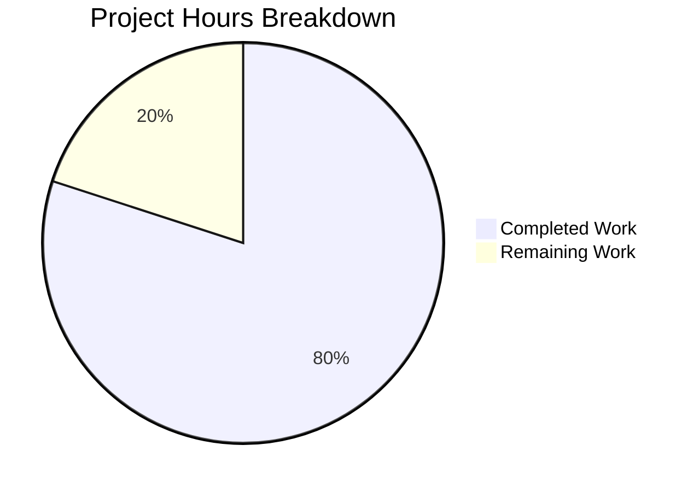

# Project Guide — Express.js Integration for hao-backprop-test

## 1. Executive Summary

**Project Completion: 80% (4 hours completed out of 5 total hours)**

This project successfully integrates Express.js v5.2.1 into a minimal Node.js HTTP server tutorial project. All five in-scope deliverables defined in the Agent Action Plan have been fully implemented, validated, and committed:

| Deliverable | Status |
|---|---|
| `server.js` — Rewrite from raw `http` to Express.js with `GET /` and `GET /evening` | ✅ Complete |
| `package.json` — Add `express` dependency, fix `main` field, add `start` script | ✅ Complete |
| `package-lock.json` — Regenerated with Express.js dependency tree | ✅ Complete |
| `.gitignore` — Created to exclude `node_modules/` | ✅ Complete |
| `README.md` — Updated with Express.js documentation, endpoints, and setup | ✅ Complete |

**Runtime validation confirmed:** Both endpoints return correct responses (`GET /` → `Hello, World!\n` with 200, `GET /evening` → `Good evening` with 200), unmatched routes return 404, and the server binds to `127.0.0.1:3000` with the preserved startup log message.

The remaining 1 hour (20%) consists of human code review, PR approval, and manual verification in the target deployment environment. No functional gaps, compilation errors, or unresolved defects exist.

**Hours Calculation:**
- Completed: 4h (1h server.js rewrite + 0.5h package.json edits + 0.5h dependency install + 0.25h .gitignore + 1h README.md + 0.75h validation/testing)
- Remaining: 1h (0.5h code review/PR approval + 0.5h manual QA in target environment)
- Total: 5h
- Completion: 4 / 5 = 80%

---

## 2. Validation Results Summary

### 2.1 Final Validator Outcomes

| Validation Gate | Result | Details |
|---|---|---|
| Merge Conflicts | ✅ PASSED | Zero conflict markers found across all project files |
| Dependencies | ✅ PASSED | `npm install` → 66 packages audited, 0 vulnerabilities |
| Syntax Check | ✅ PASSED | `node -c server.js` → zero errors |
| Runtime Validation | ✅ PASSED | All 3 endpoint behaviors verified (see below) |
| File Validation | ✅ PASSED | All 5 in-scope files present and correct |

### 2.2 Runtime Endpoint Verification

| Endpoint | Expected | Actual | HTTP Status |
|---|---|---|---|
| `GET /` | `Hello, World!\n` | `Hello, World!\n` | 200 ✅ |
| `GET /evening` | `Good evening` | `Good evening` | 200 ✅ |
| `GET /unknown` | 404 response | 404 response | 404 ✅ |

### 2.3 Dependency Audit

- Express.js v5.2.1 installed (latest stable)
- 66 total packages (including transitive dependencies)
- 0 known vulnerabilities (`npm audit` clean)
- lockfileVersion 3 maintained

### 2.4 Git Repository State

- Branch: `blitzy-99b97189-296e-469e-a498-c7fac38568fa`
- 17 commits ahead of `main`
- 7 files changed: 1,558 lines added, 13 lines removed
- Working tree: clean (all changes committed)

---

## 3. Hours Breakdown — Visual Representation



**Completed Work (4 hours):**
- server.js Express.js rewrite: 1h
- package.json configuration updates: 0.5h
- Express.js dependency installation: 0.5h
- .gitignore creation: 0.25h
- README.md documentation: 1h
- Validation and runtime testing: 0.75h

**Remaining Work (1 hour):**
- Code review and PR approval: 0.5h
- Manual QA verification in target environment: 0.5h

---

## 4. Detailed Human Task Table

| # | Task | Description | Priority | Severity | Hours | Confidence |
|---|---|---|---|---|---|---|
| 1 | Review and approve PR | Review the 7 changed files (server.js rewrite, package.json edits, .gitignore, README.md, package-lock.json regeneration). Verify code quality, Express.js best practices, and response fidelity. Approve and merge the PR. | High | Low | 0.5 | High |
| 2 | Manual QA in target environment | Clone branch, run `npm install` and `npm start`, manually verify `GET /` and `GET /evening` endpoints return expected responses in the actual deployment/staging environment. Confirm server binds to `127.0.0.1:3000`. | Medium | Low | 0.5 | High |
| | **Total Remaining Hours** | | | | **1.0** | |

**Note:** The AAP explicitly marks the following as **out of scope** — they are not counted as remaining work but are documented here for awareness:
- Automated testing framework (Jest/Mocha/Supertest)
- Middleware (CORS, helmet, morgan)
- Environment variable configuration (dotenv)
- HTTPS/TLS, Docker, CI/CD pipeline
- TypeScript migration

---

## 5. Comprehensive Development Guide

### 5.1 System Prerequisites

| Requirement | Minimum Version | Verified Version |
|---|---|---|
| Node.js | 18.0.0+ (Express 5 requirement) | v20.19.5 |
| npm | 8.0.0+ | v10.8.2 |
| Operating System | Any (Linux, macOS, Windows) | — |

### 5.2 Environment Setup

```bash
# 1. Clone the repository and switch to the feature branch
git clone <repository-url>
cd <repository-name>
git checkout blitzy-99b97189-296e-469e-a498-c7fac38568fa
```

No environment variables are required. The server uses hardcoded `127.0.0.1:3000` as specified in the AAP.

### 5.3 Dependency Installation

```bash
# 2. Install Express.js and all transitive dependencies
npm install
```

**Expected output:** `66 packages` audited with `0 vulnerabilities`.

**Verify Express.js is installed:**
```bash
npm ls express
# Expected: hello_world@1.0.0 └── express@5.2.1
```

### 5.4 Application Startup

```bash
# 3. Start the server (either method works)
npm start
# OR
node server.js
```

**Expected console output:**
```
Server running at http://127.0.0.1:3000/
```

### 5.5 Verification Steps

```bash
# 4. Test the Hello World endpoint (preserved behavior)
curl http://127.0.0.1:3000/
# Expected: Hello, World!

# 5. Test the new Good Evening endpoint
curl http://127.0.0.1:3000/evening
# Expected: Good evening

# 6. Verify 404 handling on undefined routes
curl -s -o /dev/null -w "%{http_code}" http://127.0.0.1:3000/nonexistent
# Expected: 404
```

### 5.6 Syntax Validation (Optional)

```bash
# Validate JavaScript syntax without starting the server
node -c server.js
# Expected: (no output = success)

# Audit dependencies for vulnerabilities
npm audit
# Expected: found 0 vulnerabilities
```

### 5.7 Project File Structure

```
├── .gitignore              # Excludes node_modules/ from version control
├── README.md               # Project documentation with API endpoints
├── package.json            # npm manifest with express@^5.2.1 dependency
├── package-lock.json       # Lockfile (v3) with full dependency tree
├── server.js               # Express.js application (GET / and GET /evening)
├── node_modules/           # Auto-generated by npm install (git-ignored)
├── LoginTest.java          # Out-of-scope test artifact (unchanged)
├── industry.csv            # Out-of-scope data artifact (unchanged)
├── test.blitzyignore.txt   # Out-of-scope marker file (unchanged)
├── test1.blitzyignore.txt  # Out-of-scope marker file (unchanged)
└── test.py.txt             # Out-of-scope placeholder (unchanged)
```

---

## 6. Risk Assessment

### 6.1 Technical Risks

| Risk | Severity | Likelihood | Mitigation |
|---|---|---|---|
| Express 5.x is relatively new (GA Oct 2024) — potential undiscovered edge cases | Low | Low | v5.2.1 is the 3rd patch release; actively maintained. Downgrade to Express 4.x if any issues arise. |
| No automated test suite | Low | N/A | Explicitly out of scope per AAP. Add Jest + Supertest if test coverage is desired in the future. |

### 6.2 Security Risks

| Risk | Severity | Likelihood | Mitigation |
|---|---|---|---|
| No authentication on endpoints | Low | Low | Acceptable for a localhost tutorial project. Add middleware (passport, jwt) if public deployment is planned. |
| No rate limiting | Low | Low | Add `express-rate-limit` middleware if exposed to public traffic. |
| 0 npm audit vulnerabilities | None | N/A | Current state is clean. Run `npm audit` periodically. |

### 6.3 Operational Risks

| Risk | Severity | Likelihood | Mitigation |
|---|---|---|---|
| No process manager for production | Low | Low | Use PM2 or systemd for production hosting. Tutorial scope does not require this. |
| Hardcoded host/port | Low | Low | Acceptable per AAP. Use environment variables (dotenv) if configurable deployment is needed. |

### 6.4 Integration Risks

| Risk | Severity | Likelihood | Mitigation |
|---|---|---|---|
| No external service dependencies | None | N/A | Standalone application — no integration risk. |

**Overall Risk Level: LOW** — The project is a self-contained tutorial with no external dependencies beyond Express.js, no database, and no third-party API integrations.

---

## 7. Files Changed Summary

| File | Action | Lines Added | Lines Removed | Description |
|---|---|---|---|---|
| `server.js` | Modified | 13 | 9 | Rewrote from `http.createServer()` to Express.js app with `GET /` and `GET /evening` routes |
| `package.json` | Modified | 7 | 3 | Added `express@^5.2.1` dependency, fixed `main` to `server.js`, added `start` script |
| `package-lock.json` | Regenerated | 814 | 0 | Full Express.js dependency tree (lockfileVersion 3) |
| `.gitignore` | Created | 1 | 0 | Excludes `node_modules/` from version control |
| `README.md` | Modified | 62 | 1 | Comprehensive documentation with API table, setup instructions, and curl examples |

---

## 8. Consistency Verification Checklist

- [x] Completion percentage calculated from hours: 4h / (4h + 1h) = 4/5 = **80%**
- [x] Executive Summary states: "80% (4 hours completed out of 5 total hours)"
- [x] Pie chart uses: "Completed Work: 4" and "Remaining Work: 1"
- [x] Pie chart automatically shows: 80% and 20%
- [x] Task table sums to: 0.5h + 0.5h = **1.0h** (matches "Remaining Work" in pie chart)
- [x] All prose references use 80% completion
- [x] No conflicting hour or percentage statements exist
