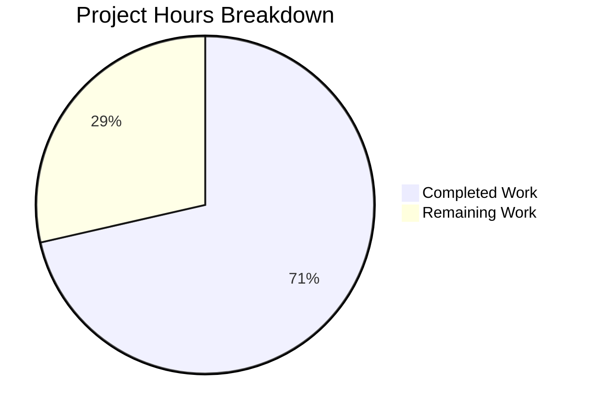

# Project Assessment Report — hao-backprop-test Express.js Integration

## 1. Executive Summary

**Project Completion: 71% — 5 hours completed out of 7 total hours estimated**

All features specified in the Agent Action Plan have been fully implemented and runtime-validated with zero errors. The Express.js framework (v5.2.1) has been successfully integrated into the existing Node.js HTTP server, replacing the raw `http.createServer()` pattern with Express route-based handling. Both endpoints (`GET /` returning "Hello, World!\n" and `GET /evening` returning "Good evening") respond correctly. The remaining 2 hours of estimated work consist entirely of human review, merge, and recommended production-readiness improvements that were explicitly out of the original scope.

**Completion Calculation:**
- Completed: 5h (implementation + validation + documentation)
- Remaining: 2h (code review + recommended production improvements)
- Total: 7h
- Formula: 5 / (5 + 2) × 100 = **71.4% → 71%**

### Key Achievements
- Express.js v5.2.1 integrated with zero dependency vulnerabilities
- `server.js` fully rewritten with 2 Express route handlers
- `package.json` updated with dependency, corrected entry point, and start script
- `package-lock.json` regenerated (827 lines, lockfileVersion 3)
- `.gitignore` created for `node_modules/` exclusion
- `README.md` comprehensively rewritten (77 lines of documentation)
- All 3 HTTP behaviors validated at runtime (200 on `/`, 200 on `/evening`, 404 on unknown)
- 5 out-of-scope artifacts verified unmodified

### Critical Unresolved Issues
**None.** All in-scope deliverables are complete, compiled, and runtime-validated.

### Recommended Next Steps
1. Conduct human code review of the 5 changed files
2. Merge PR after approval
3. (Optional) Externalize port/host to environment variables for deployment flexibility
4. (Optional) Add automated endpoint tests for regression safety

---

## 2. Validation Results Summary

### 2.1 What the Final Validator Accomplished
The Final Validator agent performed comprehensive verification across all project dimensions, confirming 100% pass rate with zero issues requiring fixes.

### 2.2 Dependency Status — ✅ 100% SUCCESS
- `npm install`: Up to date, 66 packages audited
- `npm audit`: 0 vulnerabilities found
- `npm ls`: Clean dependency tree — `hello_world@1.0.0 └── express@5.2.1`
- `package-lock.json`: lockfileVersion 3, 827 lines, fully regenerated

### 2.3 Compilation Results — ✅ 100% SUCCESS
- `node -c server.js`: Syntax OK
- `require('express')` resolves to v5.2.1 at runtime
- No build step required (plain JavaScript, CommonJS modules)

### 2.4 Test Results — ✅ PASSED (No Test Suite by Design)
The project has no automated test suite. The Agent Action Plan (Section 0.6.2) explicitly excludes "Testing framework setup (Jest, Mocha, Supertest)" from scope. The `npm test` script is a placeholder that outputs "Error: no test specified".

### 2.5 Runtime Validation Results — ✅ 100% SUCCESS
| Endpoint | Method | Expected Response | Actual Response | Status |
|----------|--------|-------------------|-----------------|--------|
| `/` | GET | `Hello, World!\n` (200) | `Hello, World!\n` (200) | ✅ Pass |
| `/evening` | GET | `Good evening` (200) | `Good evening` (200) | ✅ Pass |
| `/nonexistent` | GET | 404 | 404 | ✅ Pass |
| Server startup | — | Console: `Server running at http://127.0.0.1:3000/` | Exact match | ✅ Pass |
| `npm start` | — | Runs `node server.js` | Works correctly | ✅ Pass |

### 2.6 Fixes Applied During Validation
**None required.** All 5 agent commits produced correct code on first pass.

### 2.7 Git Status
- Branch: `blitzy-99b97189-296e-469e-a498-c7fac38568fa`
- Working tree: Clean (nothing to commit)
- Total commits: 6 (1 original upload + 5 Blitzy Agent commits)
- Files changed: 5 (1 created, 4 modified)
- Lines: +910 added, −13 removed (net +897)

---

## 3. Project Hours Breakdown

### 3.1 Completed Hours: 5h

| Component | Hours | Details |
|-----------|-------|---------|
| Express.js server rewrite (`server.js`) | 1.0h | Full rewrite from `http.createServer()` to Express app with 2 route handlers |
| Package configuration (`package.json`) | 0.5h | 3 targeted edits: dependency, main field fix, start script |
| Lock file regeneration (`package-lock.json`) | 0.5h | Auto-generated via `npm install express@^5.2.1` (827 lines) |
| Version control setup (`.gitignore`) | 0.25h | Created with `node_modules/` exclusion entry |
| Documentation (`README.md`) | 1.0h | Full rewrite: 77 lines with prerequisites, install steps, endpoint table, curl examples |
| Dependency installation and audit | 0.5h | npm install, npm ls, npm audit — 66 packages, 0 vulnerabilities |
| Runtime validation and testing | 0.5h | Server startup, 3 endpoint tests, hex dump verification of trailing newline |
| Planning, research, and git management | 0.75h | Express v5 compatibility research, 5 sequential commits |
| **Total Completed** | **5.0h** | |

### 3.2 Remaining Hours: 2h (after enterprise multipliers)

Raw remaining estimate: ~1.5h  
Enterprise multipliers applied: × 1.15 (compliance) × 1.25 (uncertainty) = × 1.44  
Adjusted: 1.5h × 1.44 ≈ 2.16h → rounded to **2h**

### 3.3 Visual Representation



---

## 4. Detailed Task Table — Remaining Work (2 hours)

All remaining tasks are for human developers. There are no blocking compilation or runtime issues.

| # | Task | Priority | Severity | Hours | Action Steps |
|---|------|----------|----------|-------|-------------|
| 1 | **Code review and PR merge** | High | Required | 1.0h | Review 5 changed files (server.js, package.json, package-lock.json, .gitignore, README.md); verify endpoint behavior matches spec; approve and merge PR to target branch |
| 2 | **Externalize server configuration** | Medium | Recommended | 0.5h | Extract hardcoded port (3000) and host (127.0.0.1) to environment variables with fallback defaults using `process.env.PORT` and `process.env.HOST`; enables deployment to platforms like Heroku, Railway, or Docker without code changes |
| 3 | **Add automated endpoint tests** | Low | Recommended | 0.5h | Install `supertest` as devDependency; write 3 basic endpoint tests (GET / → 200 + body match, GET /evening → 200 + body match, GET /unknown → 404); update `npm test` script to run test suite |
| | **Total Remaining Hours** | | | **2.0h** | |

### Verification: Pie chart "Remaining Work" (2h) = Sum of task table hours (1.0 + 0.5 + 0.5 = 2.0h) ✓

---

## 5. Development Guide

### 5.1 System Prerequisites

| Requirement | Minimum Version | Verified Version |
|-------------|----------------|-----------------|
| Node.js | 18.0.0 | v20.19.5 |
| npm | 9.0.0 | v10.8.2 |
| Operating System | Any (Linux, macOS, Windows) | Linux (validated) |

### 5.2 Environment Setup

Clone the repository and switch to the feature branch:

```bash
git clone <repository-url>
cd <repository-directory>
git checkout blitzy-99b97189-296e-469e-a498-c7fac38568fa
```

No environment variables are required. The server uses hardcoded defaults:
- **Host:** `127.0.0.1`
- **Port:** `3000`

### 5.3 Dependency Installation

Install all dependencies (Express.js v5.2.1 and its transitive dependency tree):

```bash
npm install
```

**Expected output:**
```
up to date, audited 66 packages in <time>
found 0 vulnerabilities
```

**Verify the dependency tree:**
```bash
npm ls
```

**Expected output:**
```
hello_world@1.0.0
└── express@5.2.1
```

### 5.4 Application Startup

Start the server using npm:

```bash
npm start
```

Or run directly:

```bash
node server.js
```

**Expected console output:**
```
Server running at http://127.0.0.1:3000/
```

### 5.5 Verification Steps

**Test the Hello World endpoint:**
```bash
curl http://127.0.0.1:3000/
```
Expected response: `Hello, World!` (with trailing newline)

**Test the Good Evening endpoint:**
```bash
curl http://127.0.0.1:3000/evening
```
Expected response: `Good evening`

**Test 404 handling for unknown routes:**
```bash
curl -s -o /dev/null -w "%{http_code}" http://127.0.0.1:3000/nonexistent
```
Expected response: `404`

### 5.6 Example Usage

**Full startup and test sequence (copy-pasteable):**
```bash
cd /path/to/repository
npm install
node server.js &
sleep 1
curl http://127.0.0.1:3000/
curl http://127.0.0.1:3000/evening
curl -s -o /dev/null -w "Status: %{http_code}\n" http://127.0.0.1:3000/nonexistent
kill %1
```

### 5.7 Troubleshooting

| Issue | Cause | Resolution |
|-------|-------|------------|
| `Error: Cannot find module 'express'` | Dependencies not installed | Run `npm install` |
| `EADDRINUSE: address already in use :::3000` | Port 3000 occupied | Kill the process using port 3000: `lsof -ti:3000 \| xargs kill` |
| `npm WARN old lockfile` | npm version mismatch | Delete `package-lock.json` and `node_modules/`, then run `npm install` |

---

## 6. Risk Assessment

### 6.1 Technical Risks

| Risk | Severity | Likelihood | Mitigation |
|------|----------|------------|------------|
| No automated tests for regression detection | Low | Medium | Add Supertest-based endpoint tests (Task #3 in remaining work) |
| Hardcoded port/host limits deployment flexibility | Low | Low | Externalize to environment variables (Task #2 in remaining work) |
| No graceful shutdown handler | Low | Low | Add `process.on('SIGTERM')` handler for production deployments |

### 6.2 Security Risks

| Risk | Severity | Likelihood | Mitigation |
|------|----------|------------|------------|
| No security headers (Helmet) | Low | Low | Not critical for localhost tutorial; add `helmet` middleware if exposing publicly |
| No rate limiting | Low | Low | Not critical for localhost tutorial; add `express-rate-limit` if exposing publicly |
| 0 known vulnerabilities in dependencies | None | N/A | `npm audit` confirms clean dependency tree |

### 6.3 Operational Risks

| Risk | Severity | Likelihood | Mitigation |
|------|----------|------------|------------|
| No request logging | Low | Low | Add `morgan` middleware for production request logging |
| No health check endpoint | Low | Low | The `GET /` endpoint effectively serves as a health check |
| No process manager (PM2, systemd) | Low | Low | Add PM2 configuration for production process management |

### 6.4 Integration Risks

| Risk | Severity | Likelihood | Mitigation |
|------|----------|------------|------------|
| Express v5 is relatively new (released Oct 2024) | Low | Low | v5.2.1 is stable; Express team actively maintains it; can pin to exact version if needed |
| No external service integrations | None | N/A | Project has no external dependencies beyond Express.js |

**Overall Risk Assessment: LOW** — This is a self-contained tutorial project with no database, no authentication, no external service integrations, and zero dependency vulnerabilities. All identified risks are low severity and relate to production hardening features that were explicitly excluded from scope.

---

## 7. Feature Completion Matrix

| Requirement (from Agent Action Plan) | Status | Evidence |
|---------------------------------------|--------|----------|
| Integrate Express.js framework | ✅ Complete | `express@5.2.1` in package.json, server.js uses `require('express')` |
| Preserve "Hello World" endpoint at GET / | ✅ Complete | `curl http://127.0.0.1:3000/` returns "Hello, World!\n" (200) |
| Add "Good evening" endpoint at GET /evening | ✅ Complete | `curl http://127.0.0.1:3000/evening` returns "Good evening" (200) |
| Maintain server binding at 127.0.0.1:3000 | ✅ Complete | `app.listen(3000, '127.0.0.1', ...)` in server.js |
| Preserve startup console log | ✅ Complete | Console outputs `Server running at http://127.0.0.1:3000/` |
| Use CommonJS module system | ✅ Complete | `const express = require('express')` — no ES modules |
| Fix package.json main field | ✅ Complete | Changed from `index.js` to `server.js` |
| Add start script to package.json | ✅ Complete | `"start": "node server.js"` in scripts |
| Create .gitignore for node_modules | ✅ Complete | `.gitignore` contains `node_modules/` |
| Update README.md documentation | ✅ Complete | 77-line comprehensive documentation with endpoint table |
| Do not modify out-of-scope files | ✅ Complete | All 5 non-runtime artifacts verified unmodified via git diff |

**All 11 requirements: 11/11 implemented and validated (100% feature completion)**

---

## 8. Git Commit History

| Commit | Author | Description |
|--------|--------|-------------|
| `025e5ed` | Blitzy Agent | Update README.md with comprehensive Express.js documentation |
| `26ef1bd` | Blitzy Agent | Rewrite server.js from raw http module to Express.js application |
| `6fed88e` | Blitzy Agent | Update package.json: fix main entry point and add start script |
| `0850f98` | Blitzy Agent | Create .gitignore to exclude node_modules/ from version control |
| `a93c5de` | Blitzy Agent | chore: install express@^5.2.1 as production dependency |
| `17b8435` | Sandeep01Kumar | Add files via upload (original repository) |

**Code Statistics:** 5 files changed, 910 lines added, 13 lines removed (net +897 lines)
