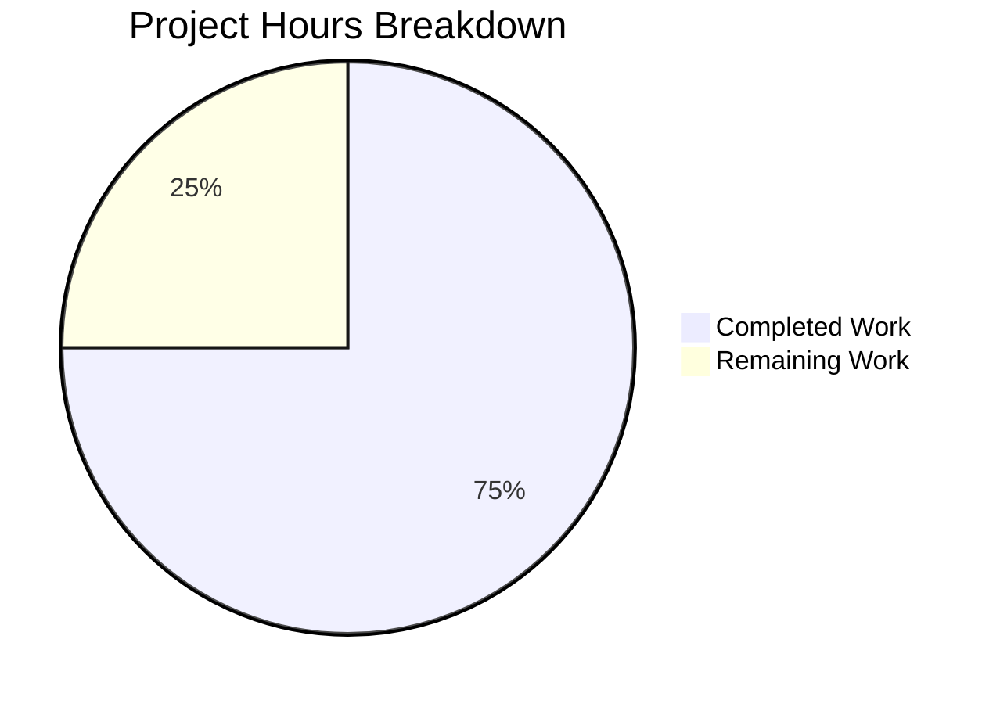

# Project Guide: hao-backprop-test — Backprop Integration Test Fixture

## 1. Executive Summary

**Project Completion: 75.0% (6 hours completed out of 8 total hours)**

The hao-backprop-test repository has been successfully validated and preserved as a fully functional Backprop integration test fixture. The project's scope was explicitly defined as a **preservation task** — maintaining the existing minimal Node.js HTTP server and all multi-format test artifacts in their current state, with zero modifications.

### Key Achievements
- ✅ All 9 in-scope files verified intact with correct content and byte sizes
- ✅ Zero-dependency npm baseline confirmed (`npm install` audits 1 package, 0 vulnerabilities)
- ✅ JavaScript syntax validation passed (`node --check server.js`)
- ✅ Runtime validation passed (server on 127.0.0.1:3000, HTTP 200, `"Hello, World!\n"`)
- ✅ Git working tree clean — no unintended modifications, no merge conflicts
- ✅ Zero agent modifications — preservation directive fully respected

### Completion Calculation
- **Completed Hours**: 6h (repository analysis, file verification, dependency validation, syntax validation, runtime validation, documentation)
- **Remaining Hours**: 2h (README review, Backprop E2E verification, PR review)
- **Total Project Hours**: 6h + 2h = 8h
- **Completion**: 6 / 8 = **75.0%**

### Critical Issues
- **None.** All validation checks passed. No compilation errors, no runtime failures, no dependency vulnerabilities.

### Recommended Next Steps
1. Review README.md content (currently `"Version: TARGET-BRANCH-UPDATE"` per base branch)
2. Run Backprop end-to-end integration against the preserved fixture
3. Approve and merge the PR

---

## 2. Validation Results Summary

### 2.1 Final Validator Accomplishments
The Final Validator agent performed a comprehensive validation pass across the entire repository. Since the Agent Action Plan specified a **preservation-only scope** (no files to create, modify, or delete), the validator confirmed that all files remain in their intended state.

### 2.2 Compilation Results

| Component | Result | Details |
|-----------|--------|---------|
| `server.js` | ✅ PASS | `node --check server.js` — zero syntax errors |
| `package.json` | ✅ VALID | Well-formed JSON, all fields intact |
| `package-lock.json` | ✅ VALID | lockfileVersion 3, zero external dependencies |

### 2.3 Test Results

| Test Type | Result | Details |
|-----------|--------|---------|
| npm test | ✅ N/A by design | Exits 1 with `"Error: no test specified"` — this is the **intentional default npm placeholder**. The project is a test fixture (the repository IS the test input, not the test executor). |

### 2.4 Runtime Validation

| Check | Result | Details |
|-------|--------|---------|
| Server Start | ✅ PASS | `node server.js` binds to `127.0.0.1:3000` |
| HTTP GET `/` | ✅ PASS | Returns HTTP 200, `Content-Type: text/plain`, body `"Hello, World!\n"` |
| HTTP HEAD `/` | ✅ PASS | Returns HTTP 200 with correct headers |
| Catch-all routing | ✅ PASS | Any path (e.g., `/any/path`) returns same 200 response |
| Server Shutdown | ✅ PASS | Process terminates cleanly on signal |

### 2.5 Dependency Status

| Check | Result | Details |
|-------|--------|---------|
| npm install | ✅ PASS | Audited 1 package, 0 vulnerabilities |
| External deps | ✅ ZERO | No `dependencies` or `devDependencies` in package.json |
| Lockfile | ✅ CLEAN | Only root project entry in package-lock.json |
| Node.js built-in | ✅ `http` | Only import: `const http = require('http')` |

### 2.6 File Integrity Verification

| File | Size | Status | Verification |
|------|------|--------|-------------|
| `server.js` | 356 bytes, 14 lines | ✅ Preserved | Syntax valid, runtime validated |
| `package.json` | 261 bytes, 10 lines | ✅ Preserved | Valid JSON, zero deps, `main: "index.js"` discrepancy intact |
| `package-lock.json` | 260 bytes, 13 lines | ✅ Preserved | lockfileVersion 3, zero external dependencies |
| `README.md` | 31 bytes, 1 line | ✅ Preserved | Content: `"Version: TARGET-BRANCH-UPDATE"` (base branch state) |
| `LoginTest.java` | 128 bytes, 12 lines | ✅ Preserved | Non-compilable Java skeleton with `com.blitzyTest` package |
| `industry.csv` | 793 bytes, 44 lines | ✅ Preserved | 43 industry categories + header |
| `test.blitzyignore.txt` | 0 bytes | ✅ Preserved | Empty Blitzy marker file |
| `test1.blitzyignore.txt` | 0 bytes | ✅ Preserved | Empty Blitzy marker file |
| `test.py.txt` | 0 bytes | ✅ Preserved | Empty double-extension marker |

### 2.7 Fixes Applied During Validation
**None.** The preservation directive required zero modifications. All files were found in their expected state. The Final Validator confirmed a clean working tree with nothing to commit.

---

## 3. Hours Breakdown — Visual Representation



### Hours Calculation Detail

**Completed: 6 hours**
| Work Item | Hours |
|-----------|-------|
| Repository scope analysis and discovery | 1.0h |
| File-by-file integrity verification (9 files) | 1.0h |
| npm dependency installation and zero-dep validation | 0.5h |
| JavaScript syntax validation | 0.5h |
| Runtime server validation (start, HTTP tests, shutdown) | 1.0h |
| Git status, branch verification, and reporting | 1.0h |
| Validation documentation | 1.0h |
| **Subtotal** | **6.0h** |

**Remaining: 2 hours**
| Work Item | Hours |
|-----------|-------|
| README.md content alignment review | 0.5h |
| Backprop end-to-end integration verification | 1.0h |
| PR review and merge approval | 0.5h |
| **Subtotal** | **2.0h** |

**Total: 6h completed + 2h remaining = 8h total → 75.0% complete**

---

## 4. Detailed Task Table — Remaining Work

All remaining tasks sum to exactly **2.0 hours**, matching the "Remaining Work" segment of the pie chart above.

| # | Task | Action Steps | Hours | Priority | Severity | Confidence |
|---|------|-------------|-------|----------|----------|------------|
| 1 | **README.md content alignment review** | Review current README.md content (`"Version: TARGET-BRANCH-UPDATE"`) against project documentation which describes it as containing project identity and immutability directive. Determine if content should be restored to `"# hao-backprop-test\ntest project for backprop integration. Do not touch!"` or if the current base branch state is intentional. | 0.5h | Medium | Low | High |
| 2 | **Backprop end-to-end integration verification** | Run Backprop analysis tool against this repository to verify: (a) server.js code analysis works correctly, (b) package.json manifest analysis detects the `main: "index.js"` discrepancy, (c) multi-format file processing handles all 9 file types, (d) zero-dependency baseline is correctly reported. | 1.0h | Medium | Medium | Medium |
| 3 | **PR review and merge approval** | Conduct final human code review of the branch. Verify git diff is clean against base. Approve PR and merge to target branch. | 0.5h | Low | Low | High |
| | **Total Remaining Hours** | | **2.0h** | | | |

---

## 5. Comprehensive Development Guide

### 5.1 System Prerequisites

| Requirement | Version | Notes |
|-------------|---------|-------|
| **Node.js** | v20.x (tested with v20.19.5) | Required for `http` built-in module and `node --check` |
| **npm** | v10.x (tested with v10.8.2) | Required for `npm install` validation |
| **curl** | Any modern version | For HTTP endpoint testing |
| **Git** | Any modern version | For branch management |
| **Operating System** | Linux, macOS, or Windows with WSL | Tested on Linux |

### 5.2 Environment Setup

No environment variables, configuration files, or external services are required. The project is entirely self-contained with zero external dependencies.

```bash
# Clone the repository and switch to the working branch
git clone <repository-url>
cd <repository-directory>
git checkout blitzy-d35775f4-c4ce-430d-a19d-b43f40f92345
```

### 5.3 Dependency Installation

```bash
# Install (confirms zero-dependency baseline)
npm install
```

**Expected Output:**
```
up to date, audited 1 package in <time>

found 0 vulnerabilities
```

### 5.4 Code Validation

```bash
# Validate JavaScript syntax
node --check server.js
```

**Expected Output:** No output (silent success means zero syntax errors).

### 5.5 Application Startup

```bash
# Start the HTTP server
node server.js
```

**Expected Output:**
```
Server running at http://127.0.0.1:3000/
```

The server binds to `127.0.0.1:3000` (localhost only — not externally accessible).

### 5.6 Verification Steps

Open a **new terminal** while the server is running:

```bash
# Test 1: Basic GET request
curl http://127.0.0.1:3000/
# Expected: Hello, World!

# Test 2: Verify HTTP status code
curl -s -o /dev/null -w "HTTP Status: %{http_code}\n" http://127.0.0.1:3000/
# Expected: HTTP Status: 200

# Test 3: Verify Content-Type header
curl -s -I http://127.0.0.1:3000/ | grep Content-Type
# Expected: Content-Type: text/plain

# Test 4: Verify catch-all routing (any path returns same response)
curl http://127.0.0.1:3000/any/path/here
# Expected: Hello, World!
```

### 5.7 Stopping the Server

Press `Ctrl+C` in the terminal where `node server.js` is running, or:

```bash
# Kill from another terminal
pkill -f "node server.js"
```

### 5.8 Running npm test (Expected to Fail by Design)

```bash
npm test
```

**Expected Output:**
```
> hello_world@1.0.0 test
> echo "Error: no test specified" && exit 1

Error: no test specified
```

**This exit code 1 is intentional.** The `package.json` test script is the default npm placeholder. The project is a test fixture — the repository itself is the test input for Backprop, not a test executor.

### 5.9 Troubleshooting

| Issue | Cause | Resolution |
|-------|-------|------------|
| `EADDRINUSE: address already in use 127.0.0.1:3000` | Port 3000 is occupied by another process | Run `fuser -k 3000/tcp` (Linux) or `lsof -ti:3000 \| xargs kill` (macOS) to free the port |
| `npm test` exits with code 1 | Intentional — default npm placeholder script | This is expected behavior, not a bug |
| `main: "index.js"` in package.json but no index.js file | Intentional discrepancy for Backprop edge-case testing | Do not fix — this is a deliberate test case |

---

## 6. Risk Assessment

### 6.1 Technical Risks

| Risk | Severity | Likelihood | Mitigation |
|------|----------|------------|------------|
| README.md content differs from original project description | Low | Confirmed | Review whether `"Version: TARGET-BRANCH-UPDATE"` is intentional for the base branch or should be restored |
| No automated test suite | Low | N/A | By design — project is a test fixture, not a test executor. Backprop provides external testing. |
| `package.json` main field points to non-existent `index.js` | None (intentional) | N/A | Preserved as deliberate edge-case for Backprop manifest analysis |

### 6.2 Security Risks

| Risk | Severity | Likelihood | Mitigation |
|------|----------|------------|------------|
| Server binds to localhost only | None (by design) | N/A | `127.0.0.1` binding prevents external network exposure |
| Zero external dependencies | None (positive) | N/A | No supply-chain attack surface — only Node.js built-in `http` module |
| No authentication on HTTP endpoint | Low | Low | Acceptable for localhost-only test fixture; not intended for production |

### 6.3 Operational Risks

| Risk | Severity | Likelihood | Mitigation |
|------|----------|------------|------------|
| No monitoring or logging (beyond console.log) | Low | N/A | Acceptable for test fixture — not production infrastructure |
| No graceful shutdown handling | Low | Low | Server process terminates on signal; acceptable for test use |
| No CI/CD pipeline | Low | N/A | Out of scope per Agent Action Plan |

### 6.4 Integration Risks

| Risk | Severity | Likelihood | Mitigation |
|------|----------|------------|------------|
| Backprop E2E integration not yet verified | Medium | Medium | Task #2 in remaining work — requires human to run Backprop against fixture |
| Node.js version compatibility not pinned | Low | Low | No `.nvmrc` or `engines` field; works with any Node.js v15+ (lockfileVersion 3 requirement) |

---

## 7. Repository Structure

```
/ (repository root — flat structure, no subdirectories)
├── server.js                  # Core runtime: Node.js HTTP server (14 lines)
├── package.json               # npm manifest: hello_world@1.0.0, zero deps
├── package-lock.json          # Lockfile: lockfileVersion 3, zero external deps
├── README.md                  # Project documentation (base branch state)
├── LoginTest.java             # Test artifact: Java skeleton (non-compilable)
├── industry.csv               # Test artifact: 43 industry categories
├── test.blitzyignore.txt      # Blitzy marker: 0-byte ignore pattern file
├── test1.blitzyignore.txt     # Blitzy marker: 0-byte ignore pattern file
├── test.py.txt                # Edge-case marker: 0-byte double-extension file
├── 100Pages.pdf               # Binary artifact (out of scope, untouched)
├── demo.jpg                   # Binary artifact (out of scope, untouched)
└── sample.doc                 # Binary artifact (out of scope, untouched)
```

**Total files**: 12 (9 in-scope text files + 3 out-of-scope binary files)
**Total repository size**: ~12 MB (excluding .git), primarily from binary files
**Source code**: 14 lines of JavaScript (server.js)

---

## 8. Git Analysis

| Metric | Value |
|--------|-------|
| **Branch** | `blitzy-d35775f4-c4ce-430d-a19d-b43f40f92345` |
| **Base Branch** | `origin/13-feb-qa-Branch` |
| **HEAD commit** | `9820214` (identical to base branch HEAD) |
| **Commits vs base** | 0 (branch is at same commit as base) |
| **Commits vs origin/main** | 3 (all README.md updates by Sandeep01Kumar) |
| **Files changed vs base** | 0 |
| **Files changed vs origin/main** | 1 (README.md: +1 line, -2 lines) |
| **Working tree** | Clean — nothing to commit |
| **Merge conflicts** | None |
| **Agent modifications** | None — preservation directive fully respected |
