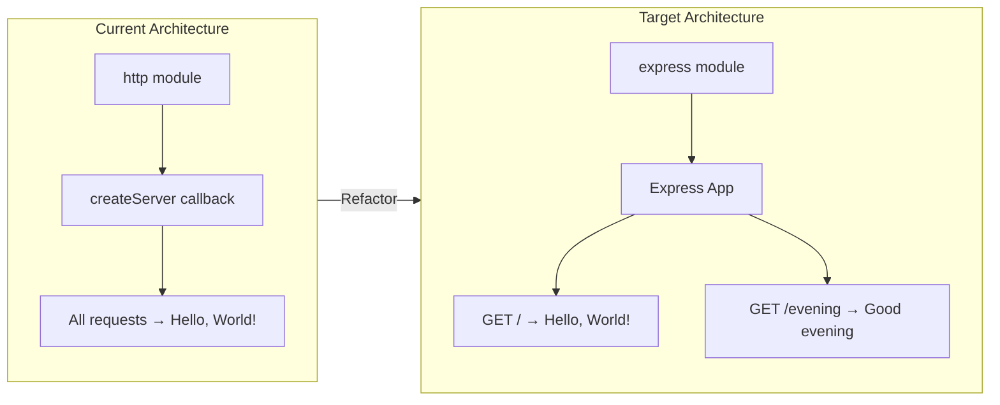

# Technical Specification

# 0. Agent Action Plan

## 0.1 Intent Clarification

### 0.1.1 Core Feature Objective

Based on the prompt, the Blitzy platform understands that the new feature requirement is to:

- **Integrate the Express.js framework** into an existing minimal Node.js HTTP server project (`hao-backprop-test`) that currently uses only the built-in `http` module with zero external dependencies
- **Preserve the existing "Hello World" endpoint** — the current `server.js` responds to every HTTP request with `"Hello, World!\n"` at `127.0.0.1:3000`; this behavior must be retained as a discrete, routable endpoint under Express.js
- **Add a new HTTP endpoint** that returns the plaintext response `"Good evening"` — this is a separate route, distinct from the existing Hello World response
- **Transition the server architecture** from a raw `http.createServer()` catch-all handler to Express.js route-based request handling, enabling path-specific responses instead of a single monolithic handler

**Implicit requirements detected:**

- The `package.json` must be updated to declare `express` as a production dependency, breaking the project's current zero-dependency baseline
- The `package-lock.json` must be regenerated to include Express.js and all of its transitive dependencies
- The `server.js` file must be rewritten to replace the `http` module import with an Express.js application instance while maintaining the same listen address (`127.0.0.1`) and port (`3000`)
- Route paths must be defined for both endpoints — the user did not specify explicit URL paths, so the implementation will use `/` for "Hello World" and `/evening` for "Good evening"
- The `package.json` `main` field currently references `index.js` (which does not exist); this discrepancy should be corrected to point to `server.js`

### 0.1.2 Special Instructions and Constraints

- **No specific directives** were provided regarding authentication, backward compatibility, or architectural patterns beyond the stated requirement
- **Convention preservation**: The existing project uses CommonJS module syntax (`require()`); the Express.js integration must follow the same module system for consistency
- **Localhost binding**: The current server binds to `127.0.0.1:3000`; this must be preserved
- **Response format**: Both endpoints return plaintext responses — no JSON, HTML, or template rendering is required

User Example (exact user input):
> "this is a tutorial of node js server hosting one endpoint that returns the response "Hello world". Could you add expressjs into the project and add another endpoint that return the response of "Good evening"?"

### 0.1.3 Technical Interpretation

These feature requirements translate to the following technical implementation strategy:

- To **integrate Express.js**, we will install the `express` npm package (v5.2.1, the current latest stable release) and refactor `server.js` to instantiate an Express application using `const app = express()` instead of `http.createServer()`
- To **preserve the Hello World endpoint**, we will create an Express route handler `app.get('/', ...)` that returns `"Hello, World!\n"` with a 200 status and `text/plain` content type — matching the existing response behavior exactly
- To **add the Good Evening endpoint**, we will create a new Express route handler `app.get('/evening', ...)` that returns `"Good evening"` as a plaintext response
- To **maintain server behavior**, we will configure Express to listen on `127.0.0.1:3000` using `app.listen(3000, '127.0.0.1', ...)` with the same startup console log
- To **update project metadata**, we will modify `package.json` to include `express` in the `dependencies` field and correct the `main` entry point from `index.js` to `server.js`

## 0.2 Repository Scope Discovery

### 0.2.1 Comprehensive File Analysis

The repository is a flat, single-directory project with no subdirectories. All 9 files reside at the repository root. The following analysis categorizes every file by its relevance to the Express.js integration feature.

**Existing files requiring modification:**

| File | Current Purpose | Modification Required | Reason |
|------|----------------|----------------------|--------|
| `server.js` | HTTP server using built-in `http` module; responds to all requests with "Hello, World!" | **MODIFY** — Full rewrite | Replace `http.createServer()` with Express.js app; add route-based handlers for `/` and `/evening` |
| `package.json` | npm manifest declaring `hello_world@1.0.0` with zero dependencies | **MODIFY** — Add dependency and fix entry point | Add `express` to `dependencies`; correct `main` field from `index.js` to `server.js`; add a `start` script |
| `package-lock.json` | Lockfile (v3) confirming zero dependencies | **REGENERATED** — Auto-updated by npm | Will be regenerated automatically when `npm install express` is executed |
| `README.md` | Two-line project description | **MODIFY** — Update documentation | Document the new Express.js architecture, available endpoints, and startup instructions |

**Existing files NOT requiring modification (unaffected by feature):**

| File | Current Purpose | Status |
|------|----------------|--------|
| `LoginTest.java` | Placeholder Java file for Backprop multi-format testing | No change — non-runtime artifact |
| `industry.csv` | CSV with 43 industry categories for test enumeration | No change — data artifact |
| `test.blitzyignore.txt` | Empty Blitzy ignore marker file | No change — 0-byte placeholder |
| `test1.blitzyignore.txt` | Empty Blitzy ignore marker file | No change — 0-byte placeholder |
| `test.py.txt` | Empty Python extension edge-case file | No change — 0-byte placeholder |

**Integration point discovery:**

- **API endpoints connecting to the feature**: The current `server.js` has a single catch-all handler. Express.js replaces this with discrete route registrations: `app.get('/')` for Hello World and `app.get('/evening')` for Good Evening
- **No database models/migrations**: The project has no database layer — not affected
- **No service classes**: The project has no service abstraction — not affected
- **No middleware/interceptors**: No existing middleware exists; Express.js will provide its own built-in middleware pipeline
- **No controllers/handlers beyond `server.js`**: The entire request-handling logic is in the anonymous callback inside `server.js` — this is the sole integration point

### 0.2.2 Web Search Research Conducted

The following research was conducted to inform the implementation approach:

- **Express.js latest stable version**: Confirmed Express.js v5.2.1 as the current `latest` tagged version on npm (published approximately 2 months ago). Express 5.0 was officially released on October 15, 2024, after a decade of development
- **Node.js compatibility**: Express 5 requires Node.js 18 or higher. The project environment runs Node.js v20.20.0, which is fully compatible
- **Express 5 breaking changes from v4**: Key changes include updated path-to-regexp routing (no sub-expression regex), automatic async error forwarding, and removal of deprecated v3/v4 API signatures. None of these affect this simple implementation
- **CommonJS compatibility**: Express 5 supports both CommonJS (`require('express')`) and ES Modules (`import express from 'express'`), confirming compatibility with the project's existing CommonJS module system

### 0.2.3 New File Requirements

Given the minimal, tutorial nature of this project, no new source files need to be created. The feature is fully implementable through modifications to the existing `server.js`. The project's flat structure and single-file architecture make adding new directories or module files unnecessary for two simple route handlers.

**New files generated automatically:**

- `node_modules/` — Created automatically by `npm install express`; contains Express.js and all transitive dependencies. This directory must be excluded from version control via `.gitignore`

**Recommended new file:**

- `.gitignore` — While not strictly part of the feature, creating a `.gitignore` file to exclude `node_modules/` is a best practice when introducing external dependencies to a previously zero-dependency project

## 0.3 Dependency Inventory

### 0.3.1 Private and Public Packages

The feature introduction transitions the project from a zero-dependency baseline to a single direct production dependency. There are no private packages involved.

| Registry | Package Name | Version | Purpose |
|----------|-------------|---------|---------|
| npm (public) | `express` | `5.2.1` | HTTP web application framework providing routing, middleware pipeline, and request/response utilities — replaces the raw `http.createServer()` pattern |

**Version justification:**
- Version `5.2.1` is the current `latest` tagged release on the npm registry
- The user did not specify a version; `5.2.1` is the default version installed via `npm install express`
- Express 5 requires Node.js 18+; the project environment runs Node.js v20.20.0, satisfying this constraint
- No version range or pinning was requested; the exact resolved version (`5.2.1`) will be locked in `package-lock.json`

**Transitive dependencies:** Express.js v5.2.1 brings a tree of transitive dependencies (including `accepts`, `body-parser`, `content-disposition`, `cookie`, `debug`, `finalhandler`, `path-to-regexp`, `qs`, `send`, `serve-static`, and others). These are managed automatically by npm and locked in `package-lock.json`. No manual management of transitive dependencies is required.

### 0.3.2 Dependency Updates

**Import Updates:**

The sole runtime file requiring import changes is `server.js`:

| File | Current Import | New Import | Transformation |
|------|---------------|------------|----------------|
| `server.js` | `const http = require('http');` | `const express = require('express');` | Replace Node.js built-in `http` module with Express.js framework import |

No other files in the repository contain JavaScript imports or require statements. The `LoginTest.java` and `test.py.txt` files are non-runtime artifacts that do not reference Node.js modules.

**External Reference Updates:**

| File | Update Required | Details |
|------|----------------|---------|
| `package.json` | Add `dependencies` block | Insert `"dependencies": { "express": "^5.2.1" }` |
| `package.json` | Fix `main` field | Change `"main": "index.js"` to `"main": "server.js"` |
| `package.json` | Add `start` script | Insert `"start": "node server.js"` in `scripts` |
| `package-lock.json` | Full regeneration | Auto-regenerated by `npm install` with Express.js dependency tree |
| `README.md` | Update documentation | Reflect Express.js usage, endpoints, and installation instructions |

## 0.4 Integration Analysis

### 0.4.1 Existing Code Touchpoints

The following diagram illustrates the architectural transformation from the current raw HTTP server to the Express.js-based routing architecture:



**Direct modifications required:**

- **`server.js` (lines 1–14 — complete rewrite)**:
  - Line 1: Replace `const http = require('http');` with `const express = require('express');`
  - Lines 3–4: Remove `hostname` and `port` constants (Express handles these via `app.listen()` parameters)
  - Lines 6–10: Replace `http.createServer()` catch-all callback with two Express route handlers:
    - `app.get('/', ...)` — serves "Hello, World!\n"
    - `app.get('/evening', ...)` — serves "Good evening"
  - Lines 12–14: Replace `server.listen(port, hostname, ...)` with `app.listen(3000, '127.0.0.1', ...)`

- **`package.json` (3 targeted edits)**:
  - Add `dependencies` object with `express` entry
  - Correct `"main": "index.js"` to `"main": "server.js"`
  - Add `"start": "node server.js"` to `scripts` block

- **`README.md` (full content update)**:
  - Update project description to reflect Express.js usage
  - Document available endpoints (`/` and `/evening`)
  - Add setup instructions (`npm install` and `npm start`)

**Dependency injections:**
- Not applicable — the project has no dependency injection container, service registry, or IoC framework

**Database/Schema updates:**
- Not applicable — the project has no database layer, ORM, or migration system

### 0.4.2 Behavioral Transition Map

The following table documents how server behavior changes at each touchpoint:

| Behavior | Before (raw `http`) | After (Express.js) |
|----------|---------------------|---------------------|
| Request to `GET /` | Returns "Hello, World!\n" (200) | Returns "Hello, World!\n" (200) — **preserved** |
| Request to `GET /evening` | Returns "Hello, World!\n" (200) | Returns "Good evening" (200) — **new endpoint** |
| Request to `GET /other` | Returns "Hello, World!\n" (200) | Returns Express default 404 — **changed behavior** |
| Request to `POST /` | Returns "Hello, World!\n" (200) | Returns Express default 404 — **changed behavior** |
| Server address | `127.0.0.1:3000` | `127.0.0.1:3000` — **preserved** |
| Console log on start | `Server running at http://127.0.0.1:3000/` | `Server running at http://127.0.0.1:3000/` — **preserved** |

**Key behavioral change**: The current server returns "Hello, World!" for every request regardless of method or path. After Express.js integration, only explicitly defined routes will return responses; unmatched routes will receive Express's default 404 response. This is expected and desirable behavior for a route-based architecture.

## 0.5 Technical Implementation

### 0.5.1 File-by-File Execution Plan

Every file listed below **MUST** be created or modified to complete this feature.

**Group 1 — Core Feature Files:**

| Action | File | Purpose |
|--------|------|---------|
| **MODIFY** | `server.js` | Rewrite to use Express.js; define `GET /` (Hello World) and `GET /evening` (Good evening) route handlers; listen on `127.0.0.1:3000` |

**Group 2 — Project Configuration:**

| Action | File | Purpose |
|--------|------|---------|
| **MODIFY** | `package.json` | Add `express@^5.2.1` to `dependencies`; fix `main` to `server.js`; add `start` script |
| **REGENERATE** | `package-lock.json` | Auto-regenerated by `npm install` with full Express.js transitive dependency tree |
| **CREATE** | `.gitignore` | Exclude `node_modules/` from version control now that external dependencies exist |

**Group 3 — Documentation:**

| Action | File | Purpose |
|--------|------|---------|
| **MODIFY** | `README.md` | Document Express.js integration, available endpoints, and setup instructions |

### 0.5.2 Implementation Approach per File

**`server.js` — Full Rewrite (Core Feature)**

The existing 14-line raw HTTP server will be replaced with an Express.js application. The new structure:

```javascript
const express = require('express');
const app = express();
```

- Define two GET route handlers with `app.get('/', ...)` and `app.get('/evening', ...)`
- The `/` handler sends `"Hello, World!\n"` with `res.send()` to maintain exact response parity
- The `/evening` handler sends `"Good evening"` with `res.send()`
- Call `app.listen(3000, '127.0.0.1', ...)` with the startup log callback to preserve the existing console output

**`package.json` — Targeted Edits (Configuration)**

Three modifications to the existing manifest:

- Add `"dependencies"` field with `"express": "^5.2.1"`
- Change `"main"` from `"index.js"` to `"server.js"` to correct the pre-existing discrepancy
- Add `"start": "node server.js"` to the `"scripts"` block for convenient startup

**`package-lock.json` — Auto-Regenerated (Dependency Lock)**

This file will be fully regenerated by npm when `npm install express` is executed. The new lockfile will contain the complete dependency tree for Express.js v5.2.1 and all of its transitive dependencies. No manual editing is required.

**`.gitignore` — New File (Version Control Hygiene)**

A new `.gitignore` file is created at the repository root containing a single entry `node_modules/` to prevent the installed dependency tree from being committed to version control.

**`README.md` — Content Update (Documentation)**

The README will be updated to reflect the project's new Express.js architecture, listing the two available endpoints (`GET /` and `GET /evening`), installation steps (`npm install`), and startup command (`npm start` or `node server.js`).

### 0.5.3 User Interface Design

Not applicable — this project is a server-side HTTP API with no browser-based user interface. No Figma screens or UI design assets were provided. All interactions occur via HTTP requests and plaintext responses.

## 0.6 Scope Boundaries

### 0.6.1 Exhaustively In Scope

All files, patterns, and actions that fall within the scope of this feature addition:

**Source files:**
- `server.js` — Complete rewrite from `http` module to Express.js application with two route handlers

**Configuration files:**
- `package.json` — Add `express` dependency, fix `main` field, add `start` script
- `package-lock.json` — Regenerated automatically by `npm install`
- `.gitignore` — New file to exclude `node_modules/`

**Documentation:**
- `README.md` — Update to document Express.js architecture, endpoints, and setup

**Dependency installation:**
- `node_modules/express/**` — Express.js framework and all transitive dependencies installed via npm

**Endpoints in scope:**
- `GET /` — Returns `"Hello, World!\n"` (preserved from existing behavior)
- `GET /evening` — Returns `"Good evening"` (new endpoint)

### 0.6.2 Explicitly Out of Scope

The following items are **NOT** part of this feature addition and must not be modified or implemented:

- **`LoginTest.java`** — Non-runtime Java test artifact; unrelated to Express.js integration
- **`industry.csv`** — Static CSV data file; unrelated to Express.js integration
- **`test.blitzyignore.txt`** — Empty Blitzy marker file; unrelated to feature
- **`test1.blitzyignore.txt`** — Empty Blitzy marker file; unrelated to feature
- **`test.py.txt`** — Empty Python placeholder file; unrelated to feature
- **Additional HTTP methods** (POST, PUT, DELETE, PATCH) — Only GET endpoints are specified
- **Middleware implementation** (body-parser, CORS, logging, error-handling) — Not requested
- **Template engines or HTML rendering** — Both endpoints return plaintext only
- **HTTPS/TLS configuration** — The server remains HTTP-only on localhost
- **Environment variable configuration** (dotenv, config files) — Port and host remain hardcoded constants
- **Testing framework setup** (Jest, Mocha, Supertest) — No automated tests are requested
- **TypeScript migration** — The project remains plain JavaScript with CommonJS modules
- **Docker or containerization** — Not requested
- **CI/CD pipeline configuration** — Not requested
- **Performance optimizations** beyond the basic Express.js routing
- **Refactoring of non-runtime test artifacts** in the repository

## 0.7 Rules for Feature Addition

The following rules govern the implementation of this feature addition. These are derived from the user's instructions, the existing project conventions, and best practices for Express.js integration.

**Module system consistency:**
- The project uses CommonJS (`require()`) throughout. The Express.js integration must use `const express = require('express')` — not ES Module `import` syntax. No `"type": "module"` field shall be added to `package.json`.

**Response fidelity:**
- The existing "Hello, World!\n" response must be preserved character-for-character, including the trailing newline. The new "Good evening" response must match the user's exact wording.

**Server binding preservation:**
- The server must continue to bind to `127.0.0.1:3000`. The hostname and port must not change as part of this feature addition.

**Startup log preservation:**
- The console output `Server running at http://127.0.0.1:3000/` must be maintained to ensure consistent behavior for any existing tooling or test scripts that depend on this log message.

**Minimal dependency introduction:**
- Only `express` is added as a direct dependency. No additional middleware packages (e.g., `cors`, `helmet`, `morgan`) shall be installed unless explicitly requested.

**No-touch artifacts:**
- The non-runtime test artifacts (`LoginTest.java`, `industry.csv`, `test.blitzyignore.txt`, `test1.blitzyignore.txt`, `test.py.txt`) must not be modified, moved, or deleted. They serve as Backprop integration test fixtures.

**Lockfile version consistency:**
- The `package-lock.json` must remain at lockfileVersion 3, consistent with the existing lockfile format and the npm version (v11.1.0) in the project environment.

## 0.8 References

### 0.8.1 Repository Files and Folders Searched

The following files and folders were comprehensively examined to derive the conclusions in this Agent Action Plan:

| Path | Type | Relevance to Feature |
|------|------|---------------------|
| `/` (repository root) | Folder | Full directory listing retrieved — confirmed flat structure with 9 files, no subdirectories |
| `server.js` | File | **Primary target** — Current HTTP server implementation (14 lines); fully read and analyzed |
| `package.json` | File | **Configuration target** — npm manifest with zero dependencies; fully read and analyzed |
| `package-lock.json` | File | **Configuration target** — lockfileVersion 3 lockfile; fully read and analyzed |
| `README.md` | File | **Documentation target** — Two-line project description; fully read and analyzed |
| `LoginTest.java` | File | Read and confirmed as non-runtime Java placeholder — out of scope |
| `industry.csv` | File | Read and confirmed as static CSV data artifact — out of scope |
| `test.blitzyignore.txt` | File | Confirmed as 0-byte Blitzy marker — out of scope |
| `test1.blitzyignore.txt` | File | Confirmed as 0-byte Blitzy marker — out of scope |
| `test.py.txt` | File | Confirmed as 0-byte Python placeholder — out of scope |

### 0.8.2 Technical Specification Sections Referenced

The following existing tech spec sections were retrieved and used to inform this plan:

| Section | Key Information Extracted |
|---------|--------------------------|
| 1.1 Executive Summary | Project identity (`hao-backprop-test`), purpose as Backprop integration test fixture, key stakeholders |
| 2.1 Feature Catalog | Existing features F-001 (HTTP server), F-002 (multi-format artifacts), F-003 (zero-dependency baseline) |
| 3.2 Programming Languages | JavaScript/Node.js as sole runtime language, CommonJS module system, Node.js v20.20.0 detected |
| 3.3 Frameworks & Libraries | Confirmed zero-framework baseline — no Express, Koa, or other frameworks currently used |
| 3.4 Open Source Dependencies | Confirmed zero external dependencies via package.json, package-lock.json, and constraint C-003 |
| 5.2 Component Details | HTTP server component architecture, package metadata component, test artifact component details |

### 0.8.3 External Research Sources

| Source | Information Retrieved |
|--------|----------------------|
| npm registry (`npm view express version`) | Confirmed Express.js v5.2.1 as current `latest` tagged version |
| npm registry (`npm view express versions`) | Confirmed full version history; v5.0.0 through v5.2.1 are stable releases |
| expressjs.com — v5 release blog post | Express 5 release details, Node.js 18+ requirement, breaking changes from v4 |
| GitHub expressjs/express releases | Release notes confirming v5.2.1 as latest; security and stability focus |
| npm package page for express | Installation instructions, Node.js 18+ requirement, CommonJS and ESM support |

### 0.8.4 Attachments and Figma Assets

- **No attachments** were provided for this project
- **No Figma URLs** or UI design assets were provided — the project is a server-side HTTP API with no browser interface

