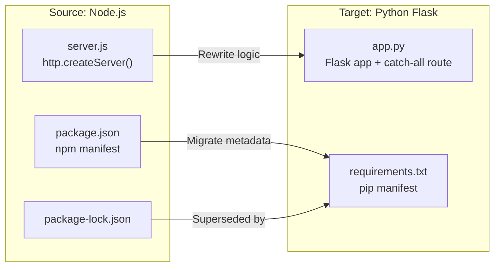
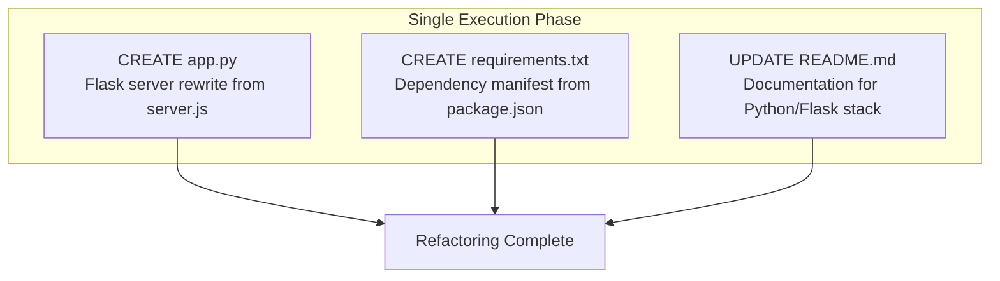

# Technical Specification

# 0. Agent Action Plan

## 0.1 Intent Clarification

### 0.1.1 Core Refactoring Objective

Based on the prompt, the Blitzy platform understands that the refactoring objective is to **perform a complete tech-stack migration** of the existing Node.js HTTP server application into a functionally equivalent Python 3 Flask application. The user's exact directive is:

> **User Requirement:** "Rewrite this Node.js server into a Python 3 Flask application, keeping every feature and functionality exactly as in the original Node.js project. Ensure the rewritten version fully matches the behavior and logic of the current implementation."

- **Refactoring type:** Tech stack migration (Node.js → Python 3 Flask)
- **Target repository:** Same repository (in-place rewrite)
- **Behavioral contract:** The rewritten Flask application must produce identical HTTP responses — status code `200`, header `Content-Type: text/plain`, and body `Hello, World!\n` — for every inbound request on every method and path, exactly as `server.js` does today
- **Server binding:** The Flask application must listen on the same host and port (`127.0.0.1:3000`) as the current Node.js server to preserve the runtime contract
- **Startup logging:** The server must log a startup confirmation message upon successful binding, mirroring the `console.log` behavior in `server.js`
- **Implicit requirement — preserve non-runtime artifacts:** Static data files (`industry.csv`), placeholder files (`test.blitzyignore.txt`, `test1.blitzyignore.txt`, `test.py.txt`), and the supplementary Java artifact (`LoginTest.java`) must remain untouched, as they serve as Backprop integration test fixtures documented in the repository's `README.md`

### 0.1.2 Special Instructions and Constraints

- **Exact behavioral parity:** Every feature and functionality must be preserved — the Flask server must be a drop-in replacement for the Node.js server from the perspective of any HTTP client
- **Catch-all routing:** The Node.js `http.createServer` handler responds uniformly to all HTTP methods (GET, POST, PUT, DELETE, PATCH, HEAD, OPTIONS) and all URL paths. The Flask application must replicate this catch-all behavior
- **No new features or behavioral extensions:** The user explicitly states the rewritten version must "fully match" the original — no additional endpoints, middleware, or error handling beyond what `server.js` implements
- **Dependency management migration:** The Node.js `package.json` / `package-lock.json` dependency model must be replaced with the Python-standard `requirements.txt` manifest
- **Zero external dependency philosophy (maintained for runtime):** The original Node.js application uses only the built-in `http` module. The Flask rewrite necessarily introduces Flask as an external dependency, but no additional packages beyond Flask and its transitive dependencies should be added

### 0.1.3 Technical Interpretation

This refactoring translates to the following technical transformation strategy:

- **Runtime replacement:** Node.js runtime → Python 3.12 runtime with Flask 3.1.2 as the web framework
- **Entry point migration:** `server.js` (14-line CommonJS module using `http.createServer`) → `app.py` (Flask application with catch-all route and `app.run()`)
- **Dependency manifest migration:** `package.json` + `package-lock.json` (npm ecosystem) → `requirements.txt` (pip ecosystem)
- **Documentation update:** `README.md` must be updated to reflect the new Python/Flask technology stack, setup instructions, and runtime commands
- **Architecture preservation:** The monolithic, single-file, single-process, stateless architecture documented in the existing technical specification (Section 5.1) is maintained — `app.py` will be the sole runtime file, just as `server.js` is today




## 0.2 Source Analysis

### 0.2.1 Comprehensive Source File Discovery

The repository is a flat-structure project with all 9 files located at the root level. There are no subdirectories. Every file has been inspected via the repository tools to determine its role in the migration.

**Runtime files requiring rewrite:**

| File | Size | Role | Migration Action |
|------|------|------|-----------------|
| `server.js` | 14 lines, 342 bytes | Sole runtime entry point — Node.js HTTP server using built-in `http` module. Binds to `127.0.0.1:3000`, responds to all requests with `200 text/plain "Hello, World!\n"`, logs startup message. | Rewrite as `app.py` using Flask |

**Dependency manifests requiring replacement:**

| File | Role | Migration Action |
|------|------|-----------------|
| `package.json` | npm package manifest — declares `hello_world@1.0.0`, MIT license, author `hxu`, no external dependencies | Replace with `requirements.txt` for Python/pip |
| `package-lock.json` | npm lock file — lockfileVersion 3, confirms zero external dependencies | Superseded by `requirements.txt` (pip does not use a separate lock file in basic workflows) |

**Documentation requiring update:**

| File | Role | Migration Action |
|------|------|-----------------|
| `README.md` | 2-line project description: heading "hao-backprop-test" and "test project for backprop integration. Do not touch!" | Update to reflect Python/Flask stack, runtime instructions |

**Files preserved as-is (no changes):**

| File | Size | Role | Reason for Exclusion |
|------|------|------|---------------------|
| `industry.csv` | 44 lines (header + 43 industry entries) | Static data artifact — single-column CSV of industry categories | Not part of runtime; serves as Backprop test data |
| `LoginTest.java` | 12 lines, 128 bytes | Non-functional Java test placeholder (`com.blitzyTest` package, contains invalid token `Web`) | Not part of runtime; Backprop multi-language test artifact |
| `test.blitzyignore.txt` | 0 bytes | Empty Blitzy ignore placeholder | Structural marker file |
| `test1.blitzyignore.txt` | 0 bytes | Empty Blitzy ignore placeholder | Structural marker file |
| `test.py.txt` | 0 bytes | Empty file-extension edge-case placeholder | Backprop file-type classification test |

### 0.2.2 Current Structure Mapping

```
Current Repository Root (flat, no subdirectories):
├── server.js                  ← RUNTIME: Node.js HTTP server (REWRITE TARGET)
├── package.json               ← MANIFEST: npm metadata (REPLACE)
├── package-lock.json          ← LOCK: npm dependency lock (REPLACE)
├── README.md                  ← DOCS: Project documentation (UPDATE)
├── industry.csv               ← DATA: Static industry list (PRESERVE)
├── LoginTest.java             ← TEST ARTIFACT: Java placeholder (PRESERVE)
├── test.blitzyignore.txt      ← MARKER: Blitzy ignore placeholder (PRESERVE)
├── test1.blitzyignore.txt     ← MARKER: Blitzy ignore placeholder (PRESERVE)
└── test.py.txt                ← MARKER: Extension edge-case file (PRESERVE)
```

### 0.2.3 Source Behavioral Analysis

The `server.js` file exhibits the following behaviors that must be exactly replicated in the Flask rewrite:

- **Server creation:** `http.createServer((req, res) => { ... })` creates an HTTP server with a single callback that handles every inbound request regardless of method or URL path
- **Response status:** `res.statusCode = 200` — always returns HTTP 200 OK
- **Response header:** `res.setHeader('Content-Type', 'text/plain')` — always returns plaintext content type
- **Response body:** `res.end('Hello, World!\n')` — always returns the string `Hello, World!` followed by a newline character
- **Binding:** `server.listen(port, hostname, ...)` binds to `127.0.0.1` on port `3000`
- **Startup log:** The callback inside `server.listen` executes `console.log` to print `Server running at http://127.0.0.1:3000/`
- **No request inspection:** The `req` parameter is never read — no URL parsing, no method checking, no header inspection, no body reading
- **Stateless:** No variables, sessions, cookies, or databases are maintained between requests


## 0.3 Target Design

### 0.3.1 Refactored Structure Planning

The target structure preserves the flat, single-file architecture of the original project. Since the Node.js server is a minimal 14-line application with no modules, routes, or business logic beyond a static response, the Flask equivalent should remain equally minimal — a single `app.py` file with a `requirements.txt` for dependency declaration.

```
Target Repository Root (flat, no subdirectories):
├── app.py                     ← NEW: Flask HTTP server (replaces server.js)
├── requirements.txt           ← NEW: Python dependency manifest (replaces package.json + package-lock.json)
├── README.md                  ← UPDATED: Documentation reflecting Python/Flask stack
├── industry.csv               ← PRESERVED: Static industry list (unchanged)
├── LoginTest.java             ← PRESERVED: Java placeholder (unchanged)
├── test.blitzyignore.txt      ← PRESERVED: Blitzy ignore placeholder (unchanged)
├── test1.blitzyignore.txt     ← PRESERVED: Blitzy ignore placeholder (unchanged)
└── test.py.txt                ← PRESERVED: Extension edge-case file (unchanged)
```

The `app.py` file will contain the complete Flask application:
- Flask app instantiation
- A catch-all route matching any URL path and any HTTP method
- Response returning `Hello, World!\n` with status `200` and `Content-Type: text/plain`
- An `app.run()` invocation binding to `127.0.0.1:3000`
- A startup print statement mirroring the original `console.log` behavior

The `requirements.txt` will pin the exact Flask version and serve as the sole dependency manifest, replacing the npm `package.json` / `package-lock.json` pair.

### 0.3.2 Web Search Research Conducted

Research was conducted on the following topics to inform the target design:

- **Node.js to Flask migration patterns:** Best practices for translating `http.createServer` handlers into Flask route decorators, including catch-all routing strategies. Key finding: Flask's `@app.route` decorator with `<path:path>` parameter and `methods` list provides the equivalent of Node.js catch-all handlers.
- **Flask 3.1.x project layout conventions:** The official Flask documentation (3.1.x) confirms that a single-file Flask application is the recommended structure for simple projects. As noted in Flask's official documentation, "A Flask application can be as simple as a single file."
- **Flask best practices for 2025:** Research confirmed that for minimal applications, a flat layout with `app.py` and `requirements.txt` at the root is the idiomatic approach. More complex structures using Blueprints and application factories are reserved for larger projects.
- **Dependency management:** Python best practice is to maintain a `requirements.txt` file listing all dependencies with pinned versions, generated via `pip freeze`.

### 0.3.3 Design Pattern Applications

Given the extreme simplicity of the source application, heavy design patterns are intentionally avoided. The following minimal patterns are applied:

- **Single-file application pattern:** Consistent with Flask's recommended approach for simple projects — the entire application resides in `app.py`, mirroring the original single-file `server.js` architecture
- **Catch-all route pattern:** A single route definition using `@app.route('/', defaults={'path': ''})` combined with `@app.route('/<path:path>')` captures all URL paths, replicating the behavior of Node.js `http.createServer` which automatically handles every request
- **Explicit method listing:** The route decorator includes `methods=['GET', 'POST', 'PUT', 'DELETE', 'PATCH', 'HEAD', 'OPTIONS']` to match all HTTP methods, since Flask routes default to GET-only
- **Plain text response pattern:** Flask's `Response` object with `mimetype='text/plain'` produces the exact same headers as the Node.js `res.setHeader('Content-Type', 'text/plain')`
- **Guard-main pattern:** The `if __name__ == '__main__':` guard ensures the server runs only when `app.py` is executed directly, following Python conventions


## 0.4 Transformation Mapping

### 0.4.1 File-by-File Transformation Plan

Every target file is mapped to its source file with the appropriate transformation mode and a description of the key changes required.

| Target File | Transformation | Source File | Key Changes |
|------------|---------------|-------------|-------------|
| `app.py` | CREATE | `server.js` | Rewrite the Node.js HTTP server as a Flask application: replace `http.createServer` with Flask app instantiation and `@app.route` decorator; replace `res.statusCode = 200` / `res.setHeader` / `res.end` with Flask `Response` object; replace `server.listen(port, hostname, callback)` with `app.run(host, port)` and a `print()` statement for the startup log message; implement catch-all routing to match all HTTP methods and URL paths |
| `requirements.txt` | CREATE | `package.json` | Create Python dependency manifest listing `Flask==3.1.2` as the sole direct dependency, replacing the npm `package.json` metadata; no lock file equivalent is needed for this minimal project |
| `README.md` | UPDATE | `README.md` | Update the project description to reflect the Python 3 / Flask technology stack; add Python-specific setup instructions (virtual environment creation, `pip install -r requirements.txt`); add Flask-specific run command (`python app.py`); preserve the project identity and purpose statement |

### 0.4.2 Cross-File Dependencies

The source project has no cross-file import dependencies — `server.js` imports only the Node.js built-in `http` module, and no other source file references `server.js`. The target project maintains this same isolation pattern:

- **`app.py` imports:**
  - `from flask import Flask, Response` — the only import required
  - No imports from other project files
- **`requirements.txt` relationship to `app.py`:**
  - `requirements.txt` declares `Flask==3.1.2`, which is the package imported by `app.py`
  - This is a dependency-declaration relationship, not a code import
- **`README.md` references:**
  - Must reference `app.py` (the new entry point) instead of `server.js`
  - Must reference `requirements.txt` instead of `package.json`
  - Must reference `python app.py` instead of `node server.js` as the run command

No import statement corrections are needed in any other file, as no file in the repository imports from `server.js` or `package.json`.

### 0.4.3 Wildcard Patterns

Given the flat structure and minimal file count of this repository, wildcard patterns are unnecessary. All files are explicitly enumerated:

- **Files being created:** `app.py`, `requirements.txt`
- **Files being updated:** `README.md`
- **Files preserved unchanged:** `industry.csv`, `LoginTest.java`, `test.blitzyignore.txt`, `test1.blitzyignore.txt`, `test.py.txt`

No glob patterns (e.g., `src/**/*.py`) are applicable because the repository contains no subdirectories and only 9 files total.

### 0.4.4 One-Phase Execution

The entire refactoring is executed by Blitzy in **one single phase**. All file operations — creating `app.py`, creating `requirements.txt`, and updating `README.md` — are performed together as a single atomic transformation. There is no phased rollout, no incremental migration, and no parallel operation of Node.js and Flask servers.




## 0.5 Dependency Inventory

### 0.5.1 Key Private and Public Packages

The source Node.js project has **zero external dependencies** — confirmed by `package.json` (no `dependencies` or `devDependencies` fields) and `package-lock.json` (only the root package entry with no child packages). It uses only the Node.js built-in `http` module.

The target Python Flask project introduces Flask as its sole direct dependency. All other packages listed below are transitive dependencies automatically installed by pip when Flask is installed.

| Registry | Package | Version | Purpose |
|----------|---------|---------|---------|
| PyPI (public) | `Flask` | `3.1.2` | Micro web framework — provides HTTP routing, request/response handling, and development server |
| PyPI (public) | `Werkzeug` | `3.1.5` | WSGI toolkit — Flask's underlying HTTP request/response library (transitive) |
| PyPI (public) | `Jinja2` | `3.1.6` | Template engine — Flask dependency, not directly used in this project (transitive) |
| PyPI (public) | `MarkupSafe` | `3.0.3` | String escaping — Jinja2 dependency (transitive) |
| PyPI (public) | `itsdangerous` | `2.2.0` | Data signing — Flask session security dependency (transitive) |
| PyPI (public) | `click` | `8.3.1` | CLI toolkit — Flask's command-line interface dependency (transitive) |
| PyPI (public) | `blinker` | `1.9.0` | Signal/event dispatching — Flask signals dependency (transitive) |

All versions listed above are verified actual versions installed via `pip install flask` in a Python 3.12.3 virtual environment. No placeholder or "latest" versions are used.

**Removed dependencies (Node.js ecosystem):**

| Registry | Package | Version | Disposition |
|----------|---------|---------|-------------|
| npm (public) | Node.js built-in `http` | N/A (built-in) | Replaced by Flask's built-in development server (`app.run()`) |
| npm | `package.json` manifest | N/A | Replaced by `requirements.txt` |
| npm | `package-lock.json` lock | lockfileVersion 3 | No separate lock file in basic Python/pip workflow |

### 0.5.2 Dependency Updates

**Import Refactoring:**

Only one file in the target project contains import statements:

- **`app.py`** — Imports `Flask` and `Response` from the `flask` package:
  - New: `from flask import Flask, Response`
  - No old imports to update (this is a newly created file)

No other files in the repository contain Python imports. The files `LoginTest.java`, `industry.csv`, `README.md`, and all placeholder files are non-Python artifacts that require no import changes.

**Removed Node.js imports:**

- `server.js` line 1: `const http = require('http');` — This CommonJS import is eliminated entirely when `server.js` is replaced by `app.py`

### 0.5.3 External Reference Updates

The following non-code files require updates to reflect the dependency and stack migration:

| File | Update Required |
|------|----------------|
| `README.md` | Replace any Node.js/npm references with Python/pip equivalents: `npm install` → `pip install -r requirements.txt`, `node server.js` → `python app.py` |
| `requirements.txt` (new) | Created as the sole dependency manifest, containing `Flask==3.1.2` |

No CI/CD files (`.github/workflows/*.yml`, `.gitlab-ci.yml`), no build files (`setup.py`, `pyproject.toml`), and no configuration files (`*.config.*`, `*.yaml`) exist in this repository. The only dependency-related files are the npm manifests being replaced and the new `requirements.txt` being created.


## 0.6 Scope Boundaries

### 0.6.1 Exhaustively In Scope

The following items are definitively within scope for this refactoring:

**Source transformations:**
- `app.py` — CREATE: New Flask application file replicating all behavior of `server.js`
- `requirements.txt` — CREATE: Python dependency manifest replacing `package.json` and `package-lock.json`

**Documentation updates:**
- `README.md` — UPDATE: Revised to reflect Python 3 / Flask stack with correct setup and run instructions

**Behavioral requirements (must-match from `server.js`):**
- HTTP server binding to `127.0.0.1:3000`
- Catch-all request handling (all HTTP methods, all URL paths)
- Response: status `200`, header `Content-Type: text/plain`, body `Hello, World!\n`
- Startup log message printed to stdout upon successful server binding
- Stateless operation with no persistent data between requests
- Single-process, single-file architecture

**Runtime environment:**
- Python 3.12 as the target runtime
- Flask 3.1.2 as the web framework
- Virtual environment setup via `python3 -m venv` and `pip install -r requirements.txt`

### 0.6.2 Explicitly Out of Scope

The following items are explicitly excluded from this refactoring:

**Preserved files (no modifications):**
- `industry.csv` — Static data artifact; not referenced by `server.js` or the future `app.py`
- `LoginTest.java` — Non-functional Java test placeholder; unrelated to the Node.js/Flask runtime
- `test.blitzyignore.txt` — Empty Blitzy marker file; structural placeholder only
- `test1.blitzyignore.txt` — Empty Blitzy marker file; structural placeholder only
- `test.py.txt` — Empty file-extension edge-case artifact; not executable Python code

**Capabilities not present in source and therefore not added:**
- Database integration or ORM setup
- Authentication or session management
- Template rendering or HTML responses
- Static file serving
- API versioning or multiple endpoints
- Error handling beyond Flask defaults
- Logging framework configuration (beyond the single startup `print()`)
- WSGI production server configuration (Gunicorn, uWSGI)
- Containerization (Docker) or CI/CD pipeline files
- Unit tests or integration test suites
- Environment variable configuration or `.env` files

**Architecture decisions not in scope:**
- Splitting `app.py` into multiple modules, blueprints, or packages
- Introducing application factory pattern
- Adding type hints, linting configuration, or code quality tooling
- Creating `pyproject.toml` or `setup.py` for package distribution


## 0.7 Refactoring Rules

The user has specified the following refactoring rules, derived directly from their requirements:

- **Exact behavioral parity:** The user states "keeping every feature and functionality exactly as in the original Node.js project." This means the Flask application must produce byte-identical HTTP responses (status code, headers, body) for every possible request that the Node.js server handles today
- **Complete functional match:** The user states "Ensure the rewritten version fully matches the behavior and logic of the current implementation." This requires that no logic branch, response path, or server behavior is altered, added, or omitted during the migration
- **Preserve all existing functionality:** No feature present in `server.js` may be dropped. Specifically:
  - The catch-all request handler must remain catch-all (no path-specific routing)
  - The static response (`Hello, World!\n`) must remain static (no dynamic content)
  - The server binding (`127.0.0.1:3000`) must remain unchanged
  - The startup log must still print to stdout
- **No behavioral additions:** Since the user mandates an exact match, no new capabilities (error pages, health checks, logging middleware, CORS headers) should be introduced that do not exist in the original `server.js`
- **Technology-appropriate idioms:** While behavior must match exactly, the implementation should use Python/Flask idiomatic patterns rather than attempting to literally translate JavaScript syntax. For example, `app.run()` replaces `server.listen()`, and `@app.route` replaces the `createServer` callback pattern
- **Non-runtime artifact preservation:** All files not part of the Node.js runtime (`industry.csv`, `LoginTest.java`, all placeholder files) must be left completely untouched to preserve the repository's role as a Backprop integration test fixture


## 0.8 References

### 0.8.1 Repository Files Searched

The following files were retrieved and analyzed to derive the conclusions in this Agent Action Plan:

| File Path | Tool Used | Purpose |
|-----------|-----------|---------|
| `server.js` | `read_file` | Analyzed the complete Node.js HTTP server source code to determine all behaviors requiring replication |
| `package.json` | `read_file` | Reviewed npm manifest for project metadata, dependencies, and scripts |
| `package-lock.json` | `read_file` | Verified zero external dependencies and lockfileVersion (3) for Node.js version inference |
| `README.md` | `read_file` | Read project description and immutability directive |
| `industry.csv` | `read_file` | Confirmed static data content (43 industry categories) and determined no runtime dependency |
| `LoginTest.java` | `read_file` | Confirmed placeholder status with invalid Java code (non-compilable) |
| `test.blitzyignore.txt` | `bash` (wc -c) | Verified empty file (0 bytes) |
| `test1.blitzyignore.txt` | `bash` (wc -c) | Verified empty file (0 bytes) |
| `test.py.txt` | `bash` (wc -c) | Verified empty file (0 bytes) |
| Repository root | `get_source_folder_contents` | Discovered all 9 files, confirmed flat structure with no subdirectories |

### 0.8.2 Technical Specification Sections Referenced

| Section | Purpose |
|---------|---------|
| 1.1 Executive Summary | Confirmed project identity (`hao-backprop-test`), author (Sandeep01Kumar), and purpose (Backprop integration test fixture) |
| 3.2 Programming Languages | Verified Node.js as sole runtime language, CommonJS module system, implied minimum Node.js 15+ |
| 5.1 High-Level Architecture | Confirmed monolithic single-file single-process architecture, zero-dependency isolation, localhost confinement |

### 0.8.3 Web Search Research Conducted

| Topic Searched | Key Sources | Findings Applied |
|----------------|-------------|-----------------|
| Node.js to Flask migration best practices | askhandle.com, mherman.org/blog, freecodecamp.org | Confirmed that Flask route decorators with method lists are the idiomatic equivalent of Node.js `http.createServer` catch-all handlers |
| Flask 3.1 project structure best practices | flask.palletsprojects.com (official 3.1.x docs), muneebdev.com, auth0.com/blog | Confirmed that single-file `app.py` structure is recommended for simple Flask applications; complex structures reserved for larger projects |
| Flask dependency and version information | PyPI, pip install output | Verified Flask 3.1.2 as latest stable release with exact transitive dependency versions |

### 0.8.4 Environment Verification

| Check | Result |
|-------|--------|
| Python runtime version | Python 3.12.3 |
| Flask installed version | 3.1.2 (verified via `pip install flask` in virtual environment) |
| Flask transitive dependencies | Werkzeug 3.1.5, Jinja2 3.1.6, MarkupSafe 3.0.3, itsdangerous 2.2.0, click 8.3.1, blinker 1.9.0 |
| Node.js source runtime version | v20.20.0 (detected in environment) |
| npm version | 11.1.0 |

### 0.8.5 Attachments

No attachments were provided for this project. No Figma URLs or design assets were specified.


